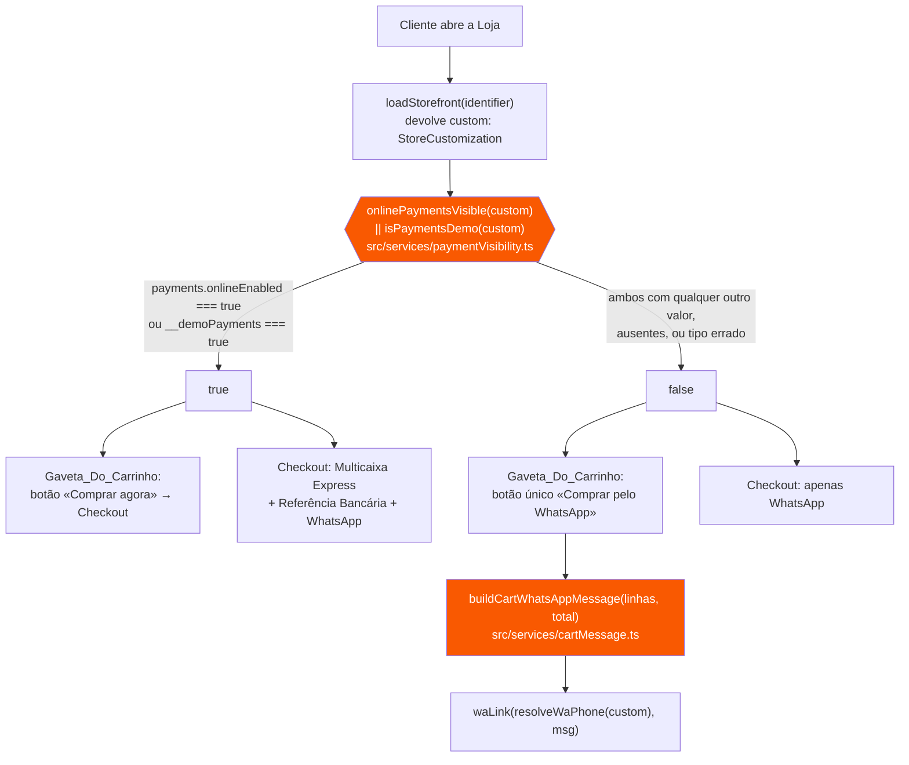
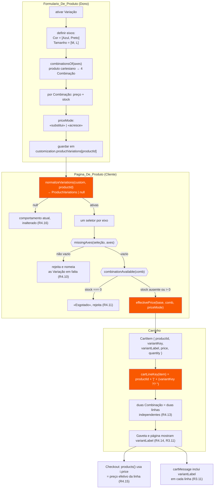

# Design Document

## Overview

Esta spec entrega doze requisitos que, vistos de perto, são doze correções
independentes. Vistos de longe, quase todos partilham a mesma causa: **regras de
negócio enterradas em vistas que desenham HTML**. A decisão de mostrar métodos de
pagamento online está escrita duas vezes, em `web/views/checkout.ts` e em
`web/lib/cartDrawer.ts`, e as duas cópias divergiram do que o Dono configurou. A
leitura de campos legados da Personalização está espalhada por `web/lib/whatsapp.ts`
e `web/templates/perks.ts`, sem defesa contra tipos errados — e uma Loja antiga
com `footer.phone` a apontar para um objeto faz a Pagina_De_Produto abrir em branco.

O eixo deste design é portanto um só:

> **Toda a regra nova testável vive num módulo de domínio puro. As vistas passam
> a ser consumidoras de decisões, não autoras delas.**

Isto não é preferência de estilo — é o que torna as regras verificáveis nesta
linha de base. O `tsconfig.json` compila `src/**` e `tests/**` com
`lib: ["ES2022"]`, **sem DOM**. Um teste que importe estaticamente um módulo com
`document`, `window` ou `localStorage` não compila. Existem dois contornos em uso
no repositório (`await import()` com especificador em constante; `readFileSync` do
texto-fonte, ver `tests/seoInfra.test.ts`), mas ambos são ginástica. Uma função
pura em `src/services/` importa-se e testa-se sem qualquer contorno.

Sete módulos puros novos concentram as regras desta spec:

| Módulo novo | Regra que passa a viver lá | Requisitos |
|---|---|---|
| `src/services/paymentVisibility.ts` | decisão única de visibilidade dos métodos online (regra + marca de demonstração) | R3.1–3.7, R3.13, R3.16 |
| `src/services/cartLine.ts` | identidade de uma linha de Carrinho (Produto + Combinação) | R4.13, R4.14 |
| `src/services/cartMessage.ts` | composição da mensagem de WhatsApp | R3.9–3.11 |
| `src/services/variations.ts` | Variação/Combinação: preço efetivo, disponibilidade, produto cartesiano | R4.3–4.12, R4.15, R4.20 |
| `src/services/storeCustom.ts` | leitura defensiva de campos legados da Personalização | R11.2–11.5 |
| `src/services/locations.ts` | lista de localizações do Bloco_SSR `location` e retrocompatibilidade | R5.5–R5.9 |
| `src/services/adminMetrics.ts` | métricas e listas da Visão geral do Painel_Admin | R7.2–7.4, R7.8 |

O que **não** muda: nada em `SEO.md` §5 (as cinco invariantes), nada na
editabilidade total do `MODELO-GUIA.md` §6.1, nenhum identificador de Preset
(`vermelho-moderno` mantém-se, `[A1]`), nenhum valor de `stores.sms_credits`.

**Âmbito por fases.** O documento propõe quatro fases entregáveis
(§ Faseamento). A **Fase D (R4, variações de produto) pode ser adiada
indefinidamente sem bloquear nada das outras três** — e continua candidata a
spec própria. É o único requisito que altera a forma dos dados de um Produto e o
único que obriga a tocar na paridade `api/_seo.js` ↔ `src/services/` por causa do
HTML pré-renderizado.

---

## Architecture
*Arquitetura*

### Onde entra cada módulo novo

```
src/services/            (puro, sem DOM — dentro do programa do tsc, testável)
  paymentVisibility.ts ──┐
  cartLine.ts ───────────┤
  cartMessage.ts ────────┤
  variations.ts ─────────┼──▶ consumido por…
  storeCustom.ts ────────┤
  locations.ts ──────────┤
  adminMetrics.ts ───────┘
                              │
        ┌─────────────────────┼──────────────────────┬─────────────────┐
        ▼                     ▼                      ▼                 ▼
web/views/checkout.ts   web/lib/cartDrawer.ts   web/views/product.ts   web/views/adminPanel.ts
web/views/cart.ts       web/lib/cart.ts         web/templates/*.ts     web/views/dashboard.ts
                                                web/templates/blocks.ts
                              │
                              ▼
                        api/_seo.js  (espelho JavaScript — paridade obrigatória,
                                      SEO.md §5.2; só R4.18 e R5.10 o exigem)
```

`web/lib/whatsapp.ts` e `web/templates/perks.ts` passam a **reexportar** de
`src/services/storeCustom.ts`, seguindo exatamente o precedente já em vigor de
`web/lib/slug.ts` e `web/lib/dom.ts` (que reexportam de `src/services/slug.ts` e
`src/services/format.ts`). Nenhum ponto de chamada existente muda de import.

### Fluxo de decisão de pagamento (R3)

Hoje há duas condições divergentes em dois ficheiros. Passa a haver uma decisão
num só módulo, composta por duas funções explícitas (D2).



O que **desaparece** deste fluxo: a leitura de `custom.__basedOn` e de
`custom.__template`, hoje presente em ambos os ficheiros
(`const isModel = !!(custom.__basedOn || custom.__template)`). É o que corrige a
avaria dos itens 2 e 3, porque `__basedOn` **é copiado** para a Loja do cliente
quando esta aplica um Modelo_De_Loja. No lugar dessa leitura entra a marca de
demonstração `__demoPayments`, escrita só pelo Semeador_De_Modelos nas
Loja_Modelo e nunca herdada — decisão tomada em **D2** (`[A2]`).

### Fluxo Combinação → Carrinho → Checkout (R4)



**Satisfaz:** R3 (todos), R4.3–4.16, R11 (pelo posicionamento de
`storeCustom.ts`), R12.4 (`api/_seo.js` continua o único espelho e mantém-se em
paridade).

---

## Components and Interfaces
*Componentes e interfaces*

Assinaturas reais. Tudo em `src/services/` é puro: sem `document`, sem `window`,
sem `localStorage`, sem `fetch`.

### 1. `src/services/paymentVisibility.ts` — novo (R3.1–3.7, R3.13, R3.16)

```ts
/**
 * Decisão ÚNICA de visibilidade dos métodos de pagamento online de uma Loja.
 * Consumida pelo Checkout e pela Gaveta_Do_Carrinho. Nenhum outro sítio decide.
 *
 * Funções totais: aceitam `unknown` porque a Personalização chega de JSON da
 * base de dados e pode ter qualquer forma (Lojas antigas incluídas). Nunca
 * lançam.
 */

/** A regra: os métodos online estão ativos nesta Loja. */
export function onlinePaymentsVisible(custom: unknown): boolean;

/** A marca de demonstração de uma Loja_Modelo (D2). */
export function isPaymentsDemo(custom: unknown): boolean;
```

Implementação: `onlinePaymentsVisible` devolve `true` se e só se
`custom?.payments?.onlineEnabled === true`; `isPaymentsDemo` devolve `true` se e
só se `custom?.__demoPayments === true`. Comparação estrita em ambas — `"true"`,
`1`, `{}` e `[]` dão `false`. Nada mais é lido; em particular, nenhuma delas lê
`__basedOn` nem `__template` (R3.2, R3.3).

Pontos de chamada a alterar:

| Ficheiro | Linha atual | Passa a |
|---|---|---|
| `web/views/checkout.ts` | `const online = !!custom.payments?.onlineEnabled;` + `const isModel = …;` + `const showOnline = online \|\| isModel;` | `const showOnline = onlinePaymentsVisible(custom) \|\| isPaymentsDemo(custom);` |
| `web/lib/cartDrawer.ts` | `const online = …;` + `const isModel = …;` + `const showCheckout = online \|\| isModel;` | `const showCheckout = onlinePaymentsVisible(custom) \|\| isPaymentsDemo(custom);` |

O rótulo do botão da Gaveta muda de «Finalizar via WhatsApp» para
**«Comprar pelo WhatsApp»** (R3.5, texto literal do requisito).

### 2. `src/services/cartLine.ts` — novo (R4.13, R4.14)

```ts
/** Identidade de uma linha de Carrinho: Produto + Combinação escolhida. */
export interface CartLineIdentity {
  readonly productId: string;
  /** Chave estável da Combinação, ou `undefined` para Produto sem Variação. */
  readonly variantKey?: string | undefined;
}

/**
 * Chave de igualdade de uma linha. Duas linhas são a mesma linha se e só se
 * `cartLineKey` coincide. Para Produtos sem Variação devolve `"<id>|"`, o que
 * mantém os carrinhos já gravados em localStorage a funcionar sem migração.
 */
export function cartLineKey(line: CartLineIdentity): string;
```

`web/lib/cart.ts` (que depende de `localStorage` e por isso fica fora do
programa de testes) passa a chavear por `cartLineKey` em vez de `productId`:

```ts
export interface CartItem {
  productId: string;
  name: string;
  price: number;          // preço EFETIVO da linha (já com a Combinação aplicada)
  imageUrl?: string;
  quantity: number;
  /** Chave da Combinação escolhida. Ausente = Produto sem Variação. */
  variantKey?: string;
  /** Etiqueta legível da Combinação, ex.: "Cor: Azul · Tamanho: M". */
  variantLabel?: string;
}

export function addToCart(storeId: string, item: Omit<CartItem, "quantity">, quantity?: number): CartItem[];
export function setQuantity(storeId: string, lineKey: string, quantity: number): CartItem[];
export function removeFromCart(storeId: string, lineKey: string): CartItem[];
```

Os dois últimos mudam de assinatura: o segundo parâmetro passa de `productId`
para `lineKey`. Os quatro pontos de chamada (`web/lib/cartDrawer.ts`,
`web/views/cart.ts`) passam a usar `cartLineKey(item)`. Como `cartLineKey` de um
item sem `variantKey` é `"<productId>|"` e não `"<productId>"`, a mudança é
mecânica e não silenciosa: quem passar um `productId` cru deixa de encontrar a
linha, e isso aparece imediatamente ao usar.

### 3. `src/services/cartMessage.ts` — novo (R3.9–3.11)

```ts
/** Linha de encomenda a compor na mensagem (visão mínima de um CartItem). */
export interface OrderLine {
  readonly name: string;
  readonly quantity: number;
  /** Preço efetivo unitário da linha. */
  readonly price: number;
  /** Etiqueta da Combinação, quando existe (R3.11). */
  readonly variantLabel?: string | undefined;
}

export interface OrderExtras {
  /** Área de entrega escolhida e respetivo valor (R3.12). */
  readonly delivery?: { readonly area: string; readonly fee: number } | undefined;
  readonly discount?: { readonly code: string; readonly amount: number } | undefined;
}

/**
 * Compõe a mensagem de WhatsApp de uma encomenda. `formatMoney` é injetado
 * (`formatKz` de `src/services/format.ts`) para o módulo ficar sem dependências.
 * Inclui sempre: uma linha por item com nome, quantidade e valor da linha; a
 * Combinação quando existe; e o total.
 */
export function buildCartWhatsAppMessage(
  lines: readonly OrderLine[],
  formatMoney: (v: number) => string,
  extras?: OrderExtras,
): string;
```

Formato produzido (mantém o que hoje existe, acrescentando a Combinação):

```
Olá! Gostaria de encomendar:
• 2x Camisola oficial — Cor: Azul · Tamanho: M (30 000,00 Kz)
• 1x Boné (8 000,00 Kz)
Entrega: Talatona (2 500,00 Kz)
Desconto (VERAO10): -3 500,00 Kz

Total: 37 000,00 Kz
```

Passa a ser usado pelos **dois** sítios que hoje compõem a mensagem à mão:
`web/lib/cartDrawer.ts` (sem extras) e `web/views/checkout.ts` (com área de
entrega e desconto, preservando o comportamento atual — R3.12).

### 4. `src/services/variations.ts` — novo (R4)

```ts
import type { ProductVariations, ProductCombination, VariationPriceMode } from "../models/domain.js";

/**
 * Lê e normaliza as Variação de um Produto a partir da Personalização.
 * Devolve `null` quando o Produto não tem Variação ativas — e é esse `null`
 * que garante o comportamento atual inalterado (R4.16). Total: aceita
 * `unknown` e nunca lança.
 */
export function normalizeVariations(custom: unknown, productId: string): ProductVariations | null;

/** Produto cartesiano dos valores dos eixos, na ordem dos eixos (R4.3). */
export function combinationsOf(axes: readonly { name: string; values: readonly string[] }[]): string[][];

/**
 * Sincroniza a lista de Combinação com os eixos atuais: mantém os dados das
 * Combinação ainda válidas e descarta as que usavam valores removidos (R4.20).
 */
export function syncCombinations(v: ProductVariations): ProductVariations;

/** Chave estável de uma Combinação (valores por ordem de eixo, separador U+001F). */
export function variantKeyOf(values: readonly string[]): string;

/** Etiqueta legível: "Cor: Azul · Tamanho: M" (R4.14, R3.11). */
export function variantLabelOf(axes: readonly { name: string }[], values: readonly string[]): string;

/** Combinação correspondente a uma seleção, ou `null` se não existir. */
export function findCombination(v: ProductVariations, values: readonly string[]): ProductCombination | null;

/**
 * Preço efetivo de uma Combinação (R4.6–4.8):
 *  - preço da Combinação ausente          → preço base
 *  - priceMode "substitui" e preço definido → preço da Combinação
 *  - priceMode "acresce"                  → preço base + preço da Combinação
 * Nunca devolve valor negativo: o resultado é limitado a 0 por baixo.
 */
export function effectivePrice(basePrice: number, comb: ProductCombination | null, mode: VariationPriceMode): number;

/** Disponibilidade: `stock === 0` esgotado; ausente = não controlado (R4.11, R4.12). */
export function combinationAvailable(comb: ProductCombination | null): boolean;

/** Nomes dos eixos sem valor escolhido, na ordem dos eixos (R4.10). */
export function missingAxes(axes: readonly { name: string }[], selection: readonly (string | null)[]): string[];

/** Texto legível dos eixos e valores, para o HTML pré-renderizado (R4.18). */
export function variationsPlainText(v: ProductVariations): string;
```

### 5. `src/services/storeCustom.ts` — novo (R11)

```ts
/** Devolve a cadeia de caracteres, ou `undefined` se o valor não for uma string usável. */
export function asText(v: unknown): string | undefined;

/** Número de WhatsApp da Loja: whatsapp.phone → footer.phone → WA_DEFAULT_PHONE. */
export function resolveWaPhone(custom: unknown): string;

export const WA_DEFAULT_PHONE = "+244 900 000 000";
export const DEFAULT_PERKS: readonly { readonly icon: string; readonly text: string }[];

/**
 * Garantias da Pagina_De_Produto. Omite itens sem a forma esperada (R11.4) e
 * devolve DEFAULT_PERKS quando não sobra nenhum (R11.5). Total: nunca lança.
 */
export function normalizePerks(custom: unknown): { icon: string; text: string }[];
```

`web/lib/whatsapp.ts` mantém a superfície pública que já tem
(`resolveWaPhone`, `WA_DEFAULT_PHONE`, `waLink`, `buildProductMessage`,
`ensureTokens`, `WA_TOKENS`) e passa a reexportar as duas primeiras.
`web/templates/perks.ts` mantém `perksList` e `perksItemsHtml`, com `perksList`
a delegar em `normalizePerks` — a função de HTML fica lá, porque importa `esc` de
`web/lib/dom.ts` e essa dependência do DOM não é para trazer para `src/`.

### 6. `src/services/locations.ts` — novo (R5)

```ts
/** Uma localização física da Loja. Mesma forma de `lumiere.boutiques[]`. */
export interface StorePlace {
  readonly name?: string | undefined;
  readonly address?: string | undefined;
  readonly lat?: number | undefined;
  readonly lng?: number | undefined;
}

/**
 * Lista de localizações a apresentar num Bloco_SSR `location`, por esta ordem:
 *  1. `block.places` quando tem pelo menos uma entrada (formato novo);
 *  2. `block.address`/`lat`/`lng` (formato de localização única, R5.9);
 *  3. a morada do rodapé (R5.8).
 * Devolve sempre pelo menos uma entrada. Total: nunca lança.
 */
export function resolveLocations(block: unknown, footerLocation?: string): StorePlace[];

/**
 * URL de mapa embutido com marcador, generalizado a partir de `boutiqueMapSrc`
 * do Lumière: com coordenadas usa OpenStreetMap (`marker=lat,lng`); só com
 * morada usa o embed da Google. Sem chave de API (R5.3).
 */
export function mapEmbedSrc(place: StorePlace, fallbackAddress?: string): string;
```

`web/templates/blocks.ts` (`locationBlock` / `locationByVariant`) passa a
iterar `resolveLocations(...)` e a emitir um mapa por localização, com o nome e a
morada marcados com `data-edit="blocks.<i>.places.<j>.name"` e
`…places.<j>.address` (R5.11, `MODELO-GUIA.md` §6.1). `web/templates/lumiere.ts`
passa a usar `mapEmbedSrc` para `lumiere.boutiques[]`, eliminando a duplicação.

O editor (`web/views/editor.ts`) ganha, no popover do bloco `location`,
«Adicionar localização» / «Remover» / «Escolher no mapa» por localização, ligando
`openMapPicker` (já existe, `web/lib/mapPicker.ts`, Leaflet, pin arrastável, sem
chave). Materializa `blocks[i].places` no arranque do editor, antes da baseline
`savedJson`, como manda o `MODELO-GUIA.md` §6.1 para arrays com fallback.

### 7. `src/services/adminMetrics.ts` — novo (R7)

```ts
export interface AdminMetricsInput {
  readonly now: number;
  readonly accounts: readonly AdminAccountLike[];
  readonly stores: readonly AdminStoreLike[];
  readonly withdrawals: readonly WithdrawalLike[];
  readonly transactions: readonly ServiceTxLike[];
  /** Nº de Produtos por Loja (`storeId` → contagem). */
  readonly productCounts: ReadonlyMap<string, number>;
}

export interface BusinessHealth {
  readonly monthRevenue: number;        // receita do mês corrente
  readonly activeSubscriptions: number;
  readonly trialsExpiring: number;      // contas em teste a expirar
  readonly trialConversion: number;     // 0..1
  readonly publishedStores: number;
  readonly suspendedStores: number;
}

export interface MonthPoint { readonly month: string; readonly revenue: number; readonly accounts: number }

export interface AttentionLists {
  readonly withdrawalsToApprove: readonly AttentionItem[];
  readonly paymentsStuck: readonly AttentionItem[];   // pendentes, falhados ou expirados
  readonly accountsExpiring7d: readonly AttentionItem[];
  readonly storesWithoutProducts: readonly AttentionItem[];
  readonly storesUnpublished: readonly AttentionItem[];
}

/** Item de lista com a ligação para o ecrã do Painel_Admin que resolve a ação (R7.5). */
export interface AttentionItem {
  readonly id: string;
  readonly title: string;
  readonly detail: string;
  readonly amount?: number | undefined;
  readonly href: string;
}

export function businessHealth(input: AdminMetricsInput): BusinessHealth;
/** Últimos 6 meses, do mais antigo para o mais recente (R7.3). */
export function monthlyEvolution(input: AdminMetricsInput, months?: number): MonthPoint[];
export function attentionLists(input: AdminMetricsInput): AttentionLists;
```

Todas as funções ignoram Loja_Modelo (Lojas com `customization.__template`) e
contas de Administrador (R7.8). A suspensão de uma Loja é derivada por
`resolveBilling` (`src/services/billing.ts`, já puro e já testado) aplicado à
conta dona.

### 8. `web/lib/logoApi.ts` — alterado (R2)

```ts
/** Nº de direções de arte pedidas ao servidor (uma por variação de `api/logo.js`). */
export const LOGO_PROPOSALS = 5;

/** Resultado do Gerador_De_Logotipos: três situações distintas (R2.6). */
export type LogoResult =
  | { kind: "ok"; images: string[]; requested: number; missing: number }
  | { kind: "server-error"; status: number; error: string; detail?: string }
  | { kind: "network-error"; message: string };

/** Pede as propostas ao servidor. Substitui `Promise<string[]>`. */
export async function generateLogos(description: string): Promise<LogoResult>;
```

- `kind: "ok"` — `missing = requested - images.length`; quando `missing > 0` a
  interface apresenta as recebidas e diz quantas faltaram (R2.3).
- `kind: "server-error"` — `error` e `detail` vêm tal como `api/logo.js` os
  devolve (R2.4). Nenhum texto é inventado pelo cliente.
- `kind: "network-error"` — o `fetch` rejeitou; a mensagem distingue
  explicitamente falha de comunicação de ausência de propostas (R2.5).

Pontos de chamada a atualizar (os dois únicos):
`web/views/wizard.ts` e `web/views/dashboard.ts` (separador `#/painel/logotipo`).
Ambos ganham: estado de progresso com submissões bloqueadas enquanto espera
(R2.7), ação «Tentar de novo» que repete com a mesma descrição (R2.8), e o selo
«Beta» no cabeçalho da secção (R2.9). `improveLogoDescription` fica intocada
(R2.11).

**Satisfaz:** R2 (todos), R3, R4, R5, R7, R11.

---

## Data Models
*Modelos de dados*

### Variação e Combinação (R4) — a decisão mais consequente

Tipos novos em `src/models/domain.ts`, ao lado de `Product`:

```ts
/** Eixo de escolha de um Produto (ex.: «Cor» com os valores Azul e Preto). */
export interface ProductVariationAxis {
  /** Nome escolhido pelo Dono. 1–40 caracteres. */
  name: string;
  /** Valores possíveis, sem duplicados, pela ordem definida pelo Dono. */
  values: string[];
}

/** Modo de preço das Variação de um Produto (R4.4). */
export type VariationPriceMode = "substitui" | "acresce";

/** Um valor de cada eixo, mais o preço e o stock próprios (R4.5). */
export interface ProductCombination {
  /** Um valor por eixo, na ordem de `ProductVariations.axes`. */
  values: string[];
  /** Preço da Combinação. Ausente = usa o preço base (R4.8). */
  price?: number | null;
  /** Stock. Ausente/`null` = não controlado (R4.12); `0` = esgotado (R4.11). */
  stock?: number | null;
}

/** Variação de um Produto. Ausente = Produto sem Variação (R4.16). */
export interface ProductVariations {
  /** Controlo de ativação do Formulario_De_Produto (R4.1). */
  enabled: boolean;
  priceMode: VariationPriceMode;
  axes: ProductVariationAxis[];
  combinations: ProductCombination[];
}
```

**Serialização: dentro da Personalização, não em coluna nova.**

```ts
// web/templates/types.ts — acrescentado a StoreCustomization
/**
 * Variação por Produto, indexadas pelo ID do Produto. Guardadas aqui, como as
 * fotos extra de `productImages`, para não exigir migração à base de dados.
 */
productVariations?: Record<string, ProductVariations>;
```

Porquê aqui e não numa coluna `products.variations`:

- O precedente existe e está documentado (`MODELO-GUIA.md` §9): `productImages`
  guarda as fotos extra por ID de Produto exatamente assim, «sem migração à BD».
- Todos os consumidores já têm a Personalização em mão: `web/views/product.ts`,
  `web/views/checkout.ts`, `web/lib/cartDrawer.ts`, `web/templates/*.ts` e
  `api/prerender.js` (que já lê `stores.customization`). Zero alterações a
  repositórios, ao `productService` ou às queries de `api/`.
- Uma coluna nova obrigaria a: migração SQL aplicada à mão no Supabase, política
  RLS revista, `Product` alterado no domínio com validação nova em
  `src/services/productService.ts`, `productRepository` alterado, e a query de
  produtos de `api/prerender.js` alterada. Cinco superfícies em vez de zero.

O custo desta escolha, dito de frente: as Variação ficam **fora** do tipo
`Product` e fora da validação do `productService`; é `normalizeVariations` que
faz o papel de guarda, e é por isso que é uma função total sobre `unknown`. E o
JSON de `customization` cresce com o número de Combinação (um Produto com
4 cores × 5 tamanhos = 20 entradas de duas propriedades; irrelevante à escala
de uma loja, mas não é para milhares de Combinação). Ver **D1** para a reversão.

**Stock por Combinação é validado e abatido no servidor.** `api/_shared.js` faz
as duas coisas, além do que já fazia sobre `products.stock`:

- `checkStock` compara a quantidade **agregada** por `(id, variantKey)` com o
  `stock` da Combinação (e, como antes, a quantidade agregada por `id` com
  `products.stock`). Agregar é obrigatório desde as Variação: duas Combinação do
  mesmo Produto **são** duas linhas (R4.13), e comparar linha a linha deixava
  passar duas linhas de 3 unidades contra um stock de 3;
- `decrementStock` abate o `stock` da Combinação numa leitura-modificação-escrita
  da coluna JSON `customization`. Os abates de todas as linhas da encomenda são
  juntados e gravados numa **única escrita por encomenda** — uma escrita por
  linha releria a coluna e perderia os abates anteriores.

Foi uma decisão explícita para o lançamento: sem abate por Combinação, um Cliente
esgotava o tamanho M enquanto o `products.stock` do Produto inteiro ainda tinha
unidades, o que é sobrevenda real e não hipotética.

As três leituras do `stock` são as do domínio, e não mudaram: **ausente** = não
controlado (passa sempre), **`0`** = esgotado (recusa), **positivo** =
disponível. Uma Combinação **não gravada** conta como disponível (R4.12) — um
campo em falta nunca bloqueia uma venda. O mesmo vale quando a linha não traz
`variantKey`, quando o Produto não tem Variação ativas e quando a leitura da
Personalização falha: nesses caminhos só o `products.stock` é validado e abatido,
exatamente como antes das Variação.

**Lacuna que fica aberta, deliberadamente.** Existe uma janela de corrida entre
`checkStock` e `decrementStock`: duas compras simultâneas da mesma Combinação
podem validar ambas contra o mesmo stock antes de qualquer uma abater, e o
resultado é uma unidade vendida a mais. Isto **já existia** para o
`products.stock` e não é introduzido aqui — a leitura e a escrita são dois
pedidos separados nos dois casos. Fechá-la exige abate atómico na base de dados
(função SQL, ou `update … where stock >= qty` com verificação da linha afetada) e
é mudança de âmbito maior do que esta; fica registada em vez de ser corrigida às
escondidas.

**Produtos já gravados (R4.16).** Um Produto sem entrada em
`productVariations` — ou com `enabled: false` — faz `normalizeVariations`
devolver `null`. Nesse caminho, a Pagina_De_Produto, o Carrinho e o Checkout
correm exatamente o código de hoje: sem seletores, `variantKey` ausente,
`cartLineKey` igual a `"<productId>|"`, preço igual a `product.price`. Não há
migração de dados nem de carrinhos em `localStorage`.

### Localizações do Bloco_SSR `location` (R5)

```ts
// web/templates/types.ts — ContentBlock, variante "location"
| { type: "location"; title?: string; variant?: "classico" | "cartao" | "estilizado";
    /** Formato de localização única (legado, mantido — R5.9). */
    address?: string; lat?: number; lng?: number;
    /** Lista de localizações. Mesma forma de `lumiere.boutiques[]` (MODELO-GUIA §8). */
    places?: { name?: string; address?: string; lat?: number; lng?: number }[] }
```

A forma de `places[]` é deliberadamente **idêntica** a `lumiere.boutiques[]`
(`{ name?, address?, lat?, lng? }`): o Lumière já resolve este problema há
tempo, com pin por coordenadas e fallback por morada. Reutilizar a forma permite
partilhar `mapEmbedSrc` e, mais tarde, migrar `boutiques[]` para `places[]` sem
inventar um terceiro formato. Os campos `address`/`lat`/`lng` do bloco **não são
removidos**: continuam a ser lidos quando `places` está vazio (R5.9).

### O que muda em `StoreCustomization`

| Campo | Estado | Requisito |
|---|---|---|
| `productVariations?: Record<string, ProductVariations>` | **novo** | R4 |
| `blocks[i].places?: StorePlace[]` (variante `location`) | **novo** | R5 |
| `blocks[i].address` / `lat` / `lng` | inalterados, ainda lidos | R5.9 |
| `payments.onlineEnabled` | inalterado — a regra de ativação | R3.1 |
| `__demoPayments?: boolean` | **novo** — marca de demonstração; escrita **só** pelo Semeador_De_Modelos nas Loja_Modelo e **nunca herdada** por uma Loja de cliente (`applyModelToStore` e `applyRawToStore` removem-na, como já fazem a `__template`) | R3.1, R3.14, R3.15, R3.16 |
| `sms.enabled` | inalterado; passa a ser ignorado para efeitos de ativação | R6.3, R6.9 |
| `customDomain` | inalterado; a submissão é rejeitada | R6.5 |
| `__basedOn` / `__template` | inalterados; **deixam de ser lidos** pelo Checkout e pela Gaveta | R3.2, R3.3 |
| `lumiere.boutiquesTitle` etc. | inalterados | — |
| `lumiere` (rodapé) — nada; o 4.º bloco usa `footer.*` novos | ver abaixo | R9 |

### Rodapé do Lumière, 4.º bloco (R9)

Hoje o 4.º bloco está chumbado no código de `web/templates/lumiere.ts`
(«O Atelier» + «Junte-se ao círculo para pré-visualizações exclusivas.»), o que
viola a §6.1 do `MODELO-GUIA.md`. Passa a:

```ts
// web/templates/types.ts — footer
footer?: {
  /* … campos atuais … */
  /** Título do 4.º bloco do rodapé (modelos que o têm, ex.: Lumière). */
  extraTitle?: string;
  /** Texto do 4.º bloco do rodapé. */
  extraText?: string;
};
```

Valores por omissão em pt-PT, adequados a comércio eletrónico: título
**«Compras seguras»**, texto **«Entrega em toda Angola, pagamento por Multicaixa
ou na entrega, e apoio pelo WhatsApp.»** Ambos marcados com
`data-edit="footer.extraTitle"` e `data-edit="footer.extraText"` (R9.3, `[E3]`).
Os três primeiros blocos não são tocados (R9.4). O Semeador_De_Modelos incrementa
`__v` do modelo «Lumière Chic» para re-sincronizar a Personalização de fábrica
(R9.5).

### Contas: um campo que falta ao Painel_Admin (R7)

`listAccounts()` seleciona hoje `id, email, name, plan, is_admin, created_at,
plan_expires_at, next_plan`. Falta-lhe `trial_ends_at`, que **existe na tabela
`profiles`** (é lido em `web/composition.ts` e alimenta `resolveBilling`). Sem
ele não há «contas em teste a expirar» nem conversão de teste para pago.

```ts
export interface AdminAccount {
  /* … campos atuais … */
  /** Fim do teste grátis (ISO) ou null. Necessário às métricas do R7. */
  trialEndsAt: string | null;
}
```

É **uma coluna acrescentada a um `select` que já corre**, não uma consulta nova.

**Satisfaz:** R4.1–4.8, R4.12, R4.16, R5.9, R7.2, R9.2, R9.3, R11.

---

## Error Handling
*Tratamento de erros*

O princípio é o mesmo em todos os requisitos: **as funções puras são totais e as
vistas nunca ficam em branco**. A avaria do R11 é exatamente o oposto disto — um
`TypeError` numa leitura de campo legado, propagado até rebentar a
Pagina_De_Produto inteira.

### Personalização com campos legados (R11)

A causa real, lida no código a `22cee78`:

| Sítio | Entrada legada | O que acontece hoje |
|---|---|---|
| `resolveWaPhone` (`web/lib/whatsapp.ts`) | `footer.phone` que não é string | devolve o valor tal como está; `waLink` chama `.replace` nele → `TypeError` |
| `perksList` (`web/templates/perks.ts`) | item de `productPerks` com `text` não-string | `(p?.text ?? "").trim()` chama `.trim` num número → `TypeError` |

Correção: `asText` filtra tudo o que não seja string usável;
`resolveWaPhone` desce a cadeia `whatsapp.phone → footer.phone → WA_DEFAULT_PHONE`
usando `asText` em cada passo (R11.2, R11.3); `normalizePerks` omite itens sem a
forma esperada e cai em `DEFAULT_PERKS` se não sobrar nenhum (R11.4, R11.5).
Nenhuma destas funções lança — é a **Propriedade 3**.

### Variação com dados inesperados (R4)

`normalizeVariations` recebe `unknown` e devolve `null` em vez de lançar quando:
`productVariations` não é objeto, a entrada do Produto não é objeto, `axes` não é
array, não há eixos com valores, ou `enabled` não é `true`. Eixos com nome vazio
e valores duplicados são descartados. Combinações cujo comprimento de `values`
não corresponde ao número de eixos são descartadas. `effectivePrice` limita o
resultado a `0` por baixo (um `price` negativo numa Combinação, ou um acréscimo
negativo maior que o preço base, não produz preço negativo).

### Gerador_De_Logotipos (R2)

Três estados explícitos em vez de uma lista vazia ambígua. O que hoje é
`return []` em dois caminhos diferentes (`!res.ok` e `catch`) passa a ser
`server-error` e `network-error`. A interface apresenta o `error` do servidor tal
como vem, com `detail` quando existe, e nunca substitui a mensagem por texto
genérico.

### Eliminação de Loja_Modelo (R1)

O caminho perigoso desta spec. A verificação em base de dados corre **antes** de
qualquer eliminação, e o seu resultado é apresentado ao Administrador no diálogo
de confirmação. Se contar Lojas que não são Loja_Modelo, a eliminação é
recusada e o Modelo_De_Loja mantém-se registado (R1.8) — ver a sequência em
**D7**.

### «Em breve» (R6)

As rejeições são silenciosas para o sistema e explícitas para o Dono: o
manipulador devolve cedo e mostra a etiqueta/toast «Em breve». Nenhum pedido de
pagamento é iniciado (`openSmsCheckout` não abre), nenhum domínio é guardado, e
`stores.sms_credits` não é lido para escrita em sítio nenhum (R6.8).

### Pagina_Loja_Nao_Encontrada (R10)

Continua a ser um estado de erro, mas útil: título, endereço pedido, ação
principal para criar Loja e ação secundária para `/lojas`, todas com caminhos
reais sem `#` (R10.5, `SEO.md` §5.1). Os códigos HTTP da §3.5 do `SEO.md`
mantêm-se exatamente: **404** para Loja inexistente ou não publicada, **410**
para conta sem acesso, ambos com `noindex` (R10.8, R10.9).

**Satisfaz:** R1.7, R1.8, R2.3–2.6, R4 (robustez), R6.2–6.5, R10.5, R10.8, R10.9, R11.

---

## Testing Strategy
*Estratégia de teste*

Linha de base a respeitar: **197 testes verdes em 34 ficheiros**, `npm run build`
a zero (R12.1–R12.3). Todos os testes novos acrescentam; nenhum existente é
alterado, exceto `tests/seoInfra.test.ts`, que ganha guardas (não perde).

### Regra de ouro desta spec

Um teste em `tests/` **não pode importar estaticamente** um módulo que dependa
do DOM. Consequência prática: se uma regra precisa de teste, ela está em
`src/services/`. Os sete módulos novos são todos importáveis diretamente. Onde
isso não é possível, usam-se os dois contornos já em uso no repositório:

1. `await import()` com o especificador numa **constante** (fica fora do
   programa do `tsc`), com stub mínimo de `location`/`localStorage` e o contrato
   da superfície declarado no próprio ficheiro de teste;
2. `readFileSync` do texto-fonte com asserções sobre o código — o padrão de
   `tests/seoInfra.test.ts`, e o único instrumento razoável para invariantes de
   ficheiros que não se conseguem executar (ex.: `api/prerender.js`).

### Ficheiros de teste novos

| Ficheiro | Tipo | Cobre |
|---|---|---|
| `tests/geradores.ts` | **geradores partilhados** (ficheiro novo nesta linha de base) | arbitrários de `StoreCustomization`, `ProductVariations`, Carrinho |
| `tests/paymentVisibility.property.test.ts` | propriedade | Propriedade 1 (R3.1–3.3) |
| `tests/variations.property.test.ts` | propriedade | Propriedade 2 (R4.6–4.8) |
| `tests/storeCustom.property.test.ts` | propriedade | Propriedade 3 (R11.2–11.5) |
| `tests/cartMessage.property.test.ts` | propriedade | Propriedade 4 (R3.9, R3.10) |
| `tests/adminMetrics.property.test.ts` | propriedade | Propriedade 5 (R7.2, R7.8) |
| `tests/variations.test.ts` | exemplos | produto cartesiano, remoção de valor (R4.3, R4.19, R4.20), `missingAxes` (R4.10), esgotado (R4.11) |
| `tests/cartLine.test.ts` | exemplos | duas Combinação = duas linhas; item legado sem `variantKey` (R4.13, R4.16) |
| `tests/locations.test.ts` | exemplos | lista, localização única legada, lista vazia → morada do rodapé (R5.5–R5.9) |
| `tests/adminMetrics.test.ts` | exemplos | evolução de 6 meses, listas vazias, ligações de cada item (R7.3, R7.5, R7.6) |
| `tests/presets.test.ts` | exemplos | nome «Ekolo Sports», id `vermelho-moderno` intacto, `getRecommendedPreset()` não anulável (R1.1–R1.3) |
| `tests/seedRename.test.ts` | exemplos + fonte (`readFileSync`) | `previousNames` com **as duas** grafias anteriores; procura pelo nome atual antes dos anteriores; renomeação a escrever só `stores.name` e `__template.name`; comparação de grafia com cadeias exatas; `factoryModelNameKeys` na deteção de modelo «em falta» (R1.1) |
| `tests/registry.test.ts` | exemplos | `neonlab` e `foodmart` fora do registo; `getTemplate` desconhecido → primeiro (R1.4, R1.10) |
| `tests/comingSoon.test.ts` | exemplos | etiquetas «Em breve» e ausência de envio de SMS no checkout (R6.1–6.6) |
| `tests/notFoundPage.test.ts` | fonte (`readFileSync`) | mesma mensagem e convite na SPA e em `notFoundHtml`; sem `#`; 404/410 (R10.6–R10.9) |
| `tests/lumiereFooter.test.ts` | fonte (`readFileSync`) | 4.º bloco do rodapé com `data-edit` (R9.3) |
| `tests/assistantScopes.test.ts` | fonte (`readFileSync`) | âmbitos `site`, `editor`, `logo`, `seo`, `seotitle` presentes e com os textos novos (R8) |

### Testes acrescentados a ficheiros existentes

- `tests/seoInfra.test.ts`: paridade de `variationsPlainText` e das localizações
  entre `src/services/` e `api/_seo.js` (só necessária quando R4.18/R5.10
  entrarem); guarda de que continua a não existir `index.html` na raiz do output
  e que o `.mb-ssr` continua escondido por recorte (`SEO.md` §5.3, §5.4).

### Equilíbrio deliberado

O que **não** leva teste de propriedade, e porquê:

- **R2 (logótipos)**: o valor está no contrato de erro, não em variação de
  entrada. Chamada HTTP a serviço externo. Exemplos bastam.
- **R6 («Em breve»)**: comportamento binário, não varia com a entrada.
- **R9, R10 (textos e rodapé)**: conteúdo e marcação; asserções sobre a fonte.
- **R1 (renomear e remover)**: verificação de estado do registo, não regra.
- **R5 (localizações)**: a regra é uma cascata de três casos enumeráveis; três
  exemplos cobrem-na melhor e mais legivelmente do que um gerador.
- **R4 seletores por Modelo_De_Loja (R4.17)**: consistência visual; revisão
  humana contra a §0.2 do `MODELO-GUIA.md`.

### Comandos de validação

`get_diagnostics` nos ficheiros tocados → `npm run build` → `npm run web:build`
→ `npx vitest run`. Cada fase só fecha com os quatro verdes (R12.1–R12.3).

**Satisfaz:** R11.6, R12.1, R12.2, R12.3.

---

## Correctness properties

*Uma propriedade é uma característica ou comportamento que se mantém verdadeiro
em todas as execuções válidas do sistema — uma afirmação formal sobre o que o
sistema deve fazer. As propriedades são a ponte entre uma especificação legível
por pessoas e garantias de correção verificáveis por máquina.*

São **cinco**. Cada uma cobre um sítio onde a quantificação universal ganha
claramente ao teste por exemplo: um espaço de entrada grande e mal comportado
(Personalização vinda de JSON arbitrário), aritmética com ramos e sinais, ou uma
invariante transversal que é fácil esquecer numa das suas aplicações. Onde a
regra tem três casos enumeráveis, o documento escolheu deliberadamente exemplos
— ver a reflexão registada na pré-análise.

Geradores partilhados em **`tests/geradores.ts`** — **ficheiro novo** nesta linha
de base. Contém, no mínimo: `customizationArb` (Personalização arbitrária,
incluindo `__basedOn`, `__template`, `__demoPayments` (presente, ausente e de
tipo errado), `payments.onlineEnabled` de tipo errado,
`footer.phone`/`whatsapp.phone` de tipo errado e `productPerks` malformado),
`variationsArb`, `combinationArb`, `orderLineArb` e `adminSnapshotArb`.

### Propriedade 1: A visibilidade dos métodos online depende de dois campos, e de mais nenhum

*Para qualquer* Personalização — incluindo Personalizações com `__basedOn`, com
`__template`, com `payments` ausente, e com `payments.onlineEnabled` ou
`__demoPayments` de qualquer tipo — a decisão
`onlinePaymentsVisible(custom) || isPaymentsDemo(custom)` termina sem lançar e é
igual a `custom?.payments?.onlineEnabled === true || custom?.__demoPayments === true`;
o seu resultado **não muda** quando se acrescenta ou remove `__basedOn` ou
`__template` à mesma Personalização; e acrescentar ou remover `__demoPayments`
altera o resultado **apenas** quando `payments.onlineEnabled` não é `true`.

- Ficheiro de teste: `tests/paymentVisibility.property.test.ts`
- Etiqueta: `// Feature: melhorias-loja-e-admin, Property 1: Para qualquer Personalização, a visibilidade dos métodos de pagamento online é igual a payments.onlineEnabled === true || __demoPayments === true, é insensível a __basedOn e __template, e só depende de __demoPayments quando payments.onlineEnabled não é true`
- `numRuns: 100` (mínimo)
- **Validates: Requirements 3.1, 3.2, 3.3, 3.13, 3.16**

### Propriedade 2: O preço efetivo de uma Combinação nunca é negativo e cai no preço base quando não há preço definido

*Para qualquer* preço base não negativo, *qualquer* Combinação e *qualquer* modo
de preço: se a Combinação não define preço, `effectivePrice` devolve o preço
base; se o modo é «substitui» e a Combinação define preço, devolve o preço da
Combinação; se o modo é «acresce», devolve a soma do preço base com o valor da
Combinação; e em todos os casos o resultado é um número finito maior ou igual a
zero.

- Ficheiro de teste: `tests/variations.property.test.ts`
- Etiqueta: `// Feature: melhorias-loja-e-admin, Property 2: Para qualquer preço base, Combinação e modo de preço, o preço efetivo nunca é negativo e é igual ao preço base quando a Combinação não define preço`
- `numRuns: 100` (mínimo)
- **Validates: Requirements 4.6, 4.7, 4.8, 4.16**

### Propriedade 3: A leitura de campos legados nunca lança

*Para qualquer* valor de entrada — objeto, `null`, `undefined`, número, cadeia,
array, ou objeto com campos de tipo errado em `footer.phone`, `whatsapp.phone` e
`productPerks` — `resolveWaPhone` termina sem lançar e devolve uma cadeia de
caracteres não vazia, `normalizePerks` termina sem lançar e devolve uma lista com
pelo menos um item em que todos os itens têm `icon` e `text` do tipo cadeia, e
`waLink(resolveWaPhone(x), "…")` produz um URL válido.

- Ficheiro de teste: `tests/storeCustom.property.test.ts`
- Etiqueta: `// Feature: melhorias-loja-e-admin, Property 3: Para qualquer entrada, resolveWaPhone e normalizePerks nunca lançam e devolvem sempre valores do tipo declarado`
- `numRuns: 100` (mínimo)
- **Validates: Requirements 11.1, 11.2, 11.3, 11.4, 11.5, 11.6**

> É a propriedade que apanha a avaria do R11. A Pagina_De_Produto abria em branco
> porque `.replace` era chamado num objeto e `.trim` num número; uma propriedade
> de totalidade cobre estas duas variantes e as que ninguém enumerou.

### Propriedade 4: A mensagem de WhatsApp contém a encomenda inteira

*Para qualquer* Carrinho não vazio, a mensagem produzida por
`buildCartWhatsAppMessage` contém, para cada linha, o nome do Produto, a
quantidade e o valor da linha formatado; contém a etiqueta da Combinação em todas
as linhas que a definem; e contém o total formatado da encomenda.

- Ficheiro de teste: `tests/cartMessage.property.test.ts`
- Etiqueta: `// Feature: melhorias-loja-e-admin, Property 4: Para qualquer Carrinho não vazio, a mensagem de WhatsApp contém o nome, a quantidade e o valor de cada item, a Combinação quando existe, e o total`
- `numRuns: 100` (mínimo)
- **Validates: Requirements 3.9, 3.10, 3.11**

### Propriedade 5: As métricas de admin ignoram as Loja_Modelo e mantêm-se nos limites

*Para qualquer* conjunto de contas, Lojas, levantamentos e transações,
acrescentar uma Loja_Modelo (Loja com `customization.__template`) não altera
nenhuma das seis métricas de saúde do negócio nem nenhuma das cinco listas de «A
precisar de atenção»; nenhuma métrica é negativa; a conversão de teste para pago
fica entre 0 e 1 inclusive; e nenhuma contagem de Lojas excede o número de Lojas
que não são Loja_Modelo.

- Ficheiro de teste: `tests/adminMetrics.property.test.ts`
- Etiqueta: `// Feature: melhorias-loja-e-admin, Property 5: Para qualquer conjunto de dados de admin, acrescentar uma Loja_Modelo não altera nenhuma métrica nem nenhuma lista, e todas as métricas se mantêm nos seus limites`
- `numRuns: 100` (mínimo)
- **Validates: Requirements 7.2, 7.4, 7.8**

> A exclusão de Loja_Modelo é aplicada em **dezoito** agregações distintas —
> numeradas em comentário em `src/services/adminMetrics.ts`: seis métricas de
> saúde (1–6), duas séries mensais (7–8), cinco listas de atenção (9–13) e cinco
> totais globais (14–18). É o tipo de filtro que se esquece exatamente numa delas
> — e um gerador que mete sempre uma Loja_Modelo na entrada encontra qual.

Os cinco totais globais são `overviewCounts` e estão em
`src/services/adminMetrics.ts`, não em `web/supabase/admin.ts`, porque metade
deles **escapava** à exclusão do R7.8 enquanto era contagem crua em base de
dados: `salesTotal` somava as encomendas de demonstração das Loja_Modelo,
`accounts` contava as contas de Administrador, e `pendingWithdrawals` era um
`count` com `eq("status","requested")` e nada mais — sem saber a que Loja o
levantamento pertencia. Sendo função pura sobre os mesmos conjuntos elegíveis das
outras treze agregações, a exclusão passou a ser testável pela Propriedade 5, e
`published` e `pendingWithdrawals` passam a coincidir por construção com
`businessHealth().publishedStores` e com o comprimento de
`attentionLists().withdrawalsToApprove`. É a decisão **D8** aplicada a estes
totais.

**Satisfaz:** R3.1–3.3, R3.9–3.11, R3.13, R3.16, R4.6–4.8, R4.16, R7.2, R7.4, R7.8, R11 (todos).

---

## Faseamento

Quatro fases, ordenadas por **valor entregue**, não por camada técnica. Cada uma
é reversível por si, validável por si (`npm run build` + `npm run web:build` +
`npx vitest run` verdes no fim de cada uma — R12.1–R12.3), e nenhuma depende de
outra posterior. O custo relativo é dado em unidades comparadas, não em horas.

### Fase A — o que o utilizador sente de imediato (custo: 1×)

| Item | O que entrega | Ficheiros principais |
|---|---|---|
| R3 | a decisão única de pagamento (regra + marca de demonstração); Checkout e Gaveta a concordar; a marca `__demoPayments` escrita pelo Semeador nas Loja_Modelo; mensagem de WhatsApp com a encomenda toda | `src/services/paymentVisibility.ts`, `src/services/cartMessage.ts` (novos), `web/views/checkout.ts`, `web/lib/cartDrawer.ts`, `web/supabase/models.ts` (`__demoPayments`) |
| R11 | a Pagina_De_Produto deixa de abrir em branco nas Lojas antigas | `src/services/storeCustom.ts` (novo), `web/lib/whatsapp.ts`, `web/templates/perks.ts` |
| R9 | rodapé do Lumière a falar de uma loja, e editável | `web/templates/lumiere.ts`, `web/templates/types.ts`, `web/supabase/models.ts` (`__v`) |
| R10 | «Loja não encontrada» com convite a criar loja, na SPA e no prerender | 5 vistas públicas, `api/prerender.js` |
| R6 | «Em breve» no SMS e no domínio próprio; nada se compra nem se ativa | `web/views/dashboard.ts` |

Entrega as Propriedades 1, 3 e 4 e três dos cinco ficheiros de teste de
propriedade, mais `tests/geradores.ts`. Nenhuma migração à base de dados. A única
escrita de dados desta fase é a marca `__demoPayments: true` na Personalização
das Loja_Modelo criadas ou re-sincronizadas pelo Semeador_De_Modelos (D2) —
Lojas do Administrador, nunca Lojas de cliente.

**Nota de reversão:** reversão por `git revert` do commit da fase. Os módulos
novos de `src/services/` ficam sem consumidores mas não quebram nada se ficarem;
`web/lib/whatsapp.ts` e `web/templates/perks.ts` mantêm a superfície pública, por
isso a reversão não obriga a tocar em pontos de chamada. Nenhuma Personalização
de Loja de cliente é reescrita; a marca `__demoPayments` já gravada nas
Loja_Modelo sobrevive à reversão e passa a ser ignorada, porque nenhum leitor a
procura. Nenhuma migração para reverter.

### Fase B — limpeza, conteúdo e localizações (custo: 1,5×)

| Item | O que entrega | Nota |
|---|---|---|
| R1 | Preset «Ekolo Sports»; FoodMart e Neon Lab fora da Plataforma | **inclui um passo destrutivo em produção** — ver D7 |
| R8 | ajudas de IA alinhadas com modelos prontos; §7.3 do `SEO.md` corrigida | correção factual: `api/logo.js` e o âmbito `seotitle` existem |
| R2 | logótipos com contrato de erro de três estados e selo «Beta» | `web/lib/logoApi.ts`, `wizard.ts`, `dashboard.ts` |
| R5 | várias localizações no bloco de mapa, retrocompatível | o maior item desta fase |

R5 está aqui, e não numa fase própria, porque é trabalho de Editor mais
Bloco_SSR — o mesmo tipo de trabalho de R9 e R8 — e porque o seu custo de
paridade com `api/_seo.js` (R5.10) é uma função pequena, ao contrário do de R4.
Se a fase parecer grande na execução, R5 sai para o fim sem afetar os outros três
itens.

**Nota de reversão:** R2, R5 e R8 revertem por commit. **R1 não reverte por
completo**: a eliminação das Loja_Modelo de demonstração apaga Lojas publicadas
reais e é irreversível. O código (registo, Semeador, nome do Preset) reverte; as
Lojas apagadas só voltam por reimportação a partir do Semeador — e as de FoodMart
e Neon Lab deixam de existir no Semeador, por desenho. Por isso a verificação em
base de dados corre primeiro e a eliminação é o último passo da fase.

### Fase C — dashboard de admin (custo: 1,5×)

R7 sozinho. `src/services/adminMetrics.ts` (novo, puro) mais a reescrita da Visão
geral em `web/views/adminPanel.ts`. Duas alterações de acesso a dados, ambas
pequenas e ambas declaradas em **D5**: uma coluna acrescentada ao `select` de
`listAccounts` (`trial_ends_at`) e uma consulta nova de contagem de Produtos por
Loja. Entrega a Propriedade 5.

**Nota de reversão:** reversão por commit. Sem migração e sem escrita: todas as
alterações são de leitura. A coluna `trial_ends_at` já existe em `profiles`, não
é criada aqui.

### Fase D — variações de produto (custo: 3×; pode ser adiada indefinidamente)

R4 sozinho, por ser o de maior superfície: domínio, Personalização,
Formulario_De_Produto, Pagina_De_Produto dos seis Modelo_De_Loja, Carrinho,
Gaveta_Do_Carrinho, Checkout, mensagem de WhatsApp e HTML pré-renderizado — mais
a paridade `api/_seo.js` ↔ `src/services/` que o R4.18 obriga.

> **A Fase D pode ser adiada sem bloquear nada do resto.** Nenhum item das Fases
> A, B ou C depende dela. A única costura entre elas é a etiqueta de Combinação na
> mensagem de WhatsApp (R3.11): na Fase A, `variantLabel` é um campo opcional que
> nunca vem preenchido, e a Propriedade 4 já o cobre nos dois casos. Quando a
> Fase D entrar, a etiqueta aparece sem alterar `cartMessage.ts`.
>
> **R4 continua candidato a spec própria.** Se o utilizador preferir, sai desta
> spec sem deixar buracos: os requisitos 3.11, 4.13 e 4.14 tornam-se
> não-aplicáveis por ausência de Combinação, e todo o resto fecha.

**Nota de reversão:** o código reverte por commit. Os **dados** ficam: as
Variação gravadas em `customization.productVariations` sobrevivem à reversão e
passam a ser ignoradas (nenhum leitor as procura), sem quebrar nada — é uma
propriedade desta escolha de serialização, e a principal razão pela qual foi
escolhida em vez de uma coluna nova. Carrinhos em `localStorage` com `variantKey`
ficam com linhas cuja chave volta a ser `"<productId>|"` na leitura antiga: as
linhas continuam a existir e a somar, apenas deixam de se distinguir. Nenhuma
migração para reverter.

### O que atravessa todas as fases

R12 não é uma fase: é o portão de saída de cada uma. `get_diagnostics` nos
ficheiros tocados → `npm run build` → `npm run web:build` → `npx vitest run`,
com as cinco invariantes do `SEO.md` §5 e a editabilidade total do
`MODELO-GUIA.md` §6.1 verificadas nas secções tocadas por essa fase.

---

## Decisões e alternativas

### D1 — Variação guardadas na Personalização, não numa coluna nova (R4)

**Decisão.** Tipos em `src/models/domain.ts`; serialização em
`customization.productVariations[productId]`; toda a aritmética em
`src/services/variations.ts`.

**Alternativa considerada.** Coluna `products.variations jsonb`, com os dados
dentro do Produto onde conceptualmente pertencem, sujeitos à validação de
`src/services/productService.ts` e visíveis a qualquer consulta de produtos.

**Razão da escolha.** A coluna obriga a cinco superfícies novas: migração SQL
aplicada à mão no Supabase, política RLS revista, `Product` alterado com
validação nova, `productRepository` alterado, e a consulta de produtos de
`api/prerender.js` alterada. A Personalização obriga a zero: todos os
consumidores já a têm em mão, e o precedente está documentado no
`MODELO-GUIA.md` §9 para `productImages`, que resolve exactamente o mesmo
problema («sem migração à BD»). O custo aceite é que as Variação ficam fora do
tipo `Product` e fora da validação do serviço — pago com uma função total,
`normalizeVariations`, que é a guarda.

**Como reverter.** Reverter o commit. Os dados em `productVariations` ficam na
Personalização e passam a ser ignorados; nenhuma migração inversa é necessária.
Se mais tarde se quiser a coluna, `normalizeVariations` é o único ponto a mudar:
passa a ler de `product.variations` e o resto do código não sabe a diferença.

### D2 — Marca de demonstração própria em vez da herança de `__basedOn` (R3, `[A2]`) — **decisão tomada**

**Decisão.** As leituras de `__basedOn` e `__template` saem do Checkout e da
Gaveta. No lugar delas entra uma marca de demonstração separada,
`customization.__demoPayments === true`, escrita pelo Semeador_De_Modelos
**apenas** nas Loja_Modelo e **nunca herdada** por uma Loja de cliente — que é a
diferença essencial face a `__basedOn`, esse **é** copiado para a Loja do cliente
por `applyModelToStore`, e é essa cópia a causa da avaria dos itens 2 e 3. A
decisão continua a viver num só módulo, `src/services/paymentVisibility.ts`:

```ts
export function onlinePaymentsVisible(custom: unknown): boolean;          // regra
export function isPaymentsDemo(custom: unknown): boolean;                 // marca
// nas vistas: onlinePaymentsVisible(custom) || isPaymentsDemo(custom)
```

**O que isto corrige, que é o essencial.** `__basedOn` está presente em **Lojas
de clientes reais** que aplicaram um modelo pronto. Essas Lojas mostram hoje
Multicaixa Express e Referência Bancária **sem os ter ativos**, porque a condição
`isModel = !!(custom.__basedOn || custom.__template)` os força — precisamente a
avaria que os itens 2 e 3 do pedido descrevem. Com a marca própria, uma Loja de
cliente criada a partir de um Preset ou de um Modelo_De_Loja passa a apresentar
apenas WhatsApp até o Dono ativar os pagamentos online (R3.13). As Loja_Modelo,
essas, continuam a apresentar os três métodos (R3.16).

**Alternativa considerada — a regra única, não escolhida.**
`onlinePaymentsVisible` a ler só `payments.onlineEnabled`, sem marca nenhuma:
cumpriria R3.1 na sua forma mais estreita e resolveria a mesma avaria com uma só
condição. O efeito é que as Loja_Modelo de demonstração da galeria passariam a
mostrar um checkout só com WhatsApp.

**Razão da escolha.** As demos da galeria têm valor comercial: são o que um
visitante vê antes de decidir criar loja, e devem mostrar a loja **completa**,
métodos de pagamento incluídos. Um checkout amputado numa demo vende menos. A
segunda condição que a marca reintroduz é explícita, restrita às Loja_Modelo,
vive no mesmo módulo da primeira, e — ao contrário de `__basedOn` — não tem forma
de escorregar para uma Loja de cliente: o Semeador é o único a escrevê-la, e
`applyModelToStore`/`applyRawToStore` removem-na na cópia, como já fazem a
`__template`.

**Como reverter.** Remover `isPaymentsDemo` do `||` nas duas vistas: a decisão
volta a ser a regra única. A marca já gravada nas Loja_Modelo fica na
Personalização e passa a ser ignorada — sem migração inversa.

### D3 — `generateLogos` devolve um resultado discriminado (R2)

**Decisão.** `Promise<string[]>` passa a `Promise<LogoResult>` com três variantes
(`ok`, `server-error`, `network-error`).

**Alternativa considerada.** Manter `string[]` e lançar exceção nas falhas, com
`try/catch` nos dois pontos de chamada.

**Razão da escolha.** Hoje os dois modos de falha colapsam no mesmo `return []`,
e é por isso que o Dono fica «a olhar para um ecrã vazio sem explicação»: uma
lista vazia não distingue «o servidor recusou e disse porquê» de «não houve
resposta». O tipo discriminado obriga o `tsc` a mostrar os dois pontos de chamada
que faltam tratar, o que a exceção não faz. R2.6 pede exatamente isto.

**Pontos de chamada a atualizar:** `web/views/wizard.ts` e
`web/views/dashboard.ts` (separador `#/painel/logotipo`). São os dois únicos.

**Como reverter.** Reverter o commit; os dois pontos de chamada voltam a tratar
uma lista.

### D4 — Localizações numa lista nova, com a forma de `boutiques[]` (R5)

**Decisão.** `blocks[i].places: { name?, address?, lat?, lng? }[]`, com
`resolveLocations` a cair para `address`/`lat`/`lng` do bloco e depois para a
morada do rodapé.

**Alternativa considerada.** Reescrever `address`/`lat`/`lng` como o primeiro
elemento de `places` numa migração de dados, ficando com um só formato.

**Razão da escolha.** R5.9 exige que os blocos gravados em formato de localização
única continuem a funcionar. Uma migração da Personalização de todas as Lojas
para ganhar limpeza de formato é risco sem retorno. A forma de `places[]` copia
`lumiere.boutiques[]` (`MODELO-GUIA.md` §8) porque esse código já resolve o
mesmo problema — pin por coordenadas, fallback por morada, sem chave de API — e
partilhar a forma permite partilhar `mapEmbedSrc` hoje e convergir os dois campos
mais tarde, se valer a pena.

**Como reverter.** Reverter o commit. Blocos com `places` gravado passam a ser
lidos pelo caminho legado (`address`/`lat`/`lng`), o que mostra uma localização
em vez de várias — degradação, não avaria.

### D5 — De onde vem cada métrica do dashboard (R7, assunção `[A3]`)

**A decisão que `[A3]` remeteu para o design toma-se aqui.** Duas alterações de
acesso a dados são necessárias; todo o resto deriva do que já existe.

| Métrica / lista | Fonte | Estado |
|---|---|---|
| Receita do mês corrente | `listServiceTransactions()`, `status === "paid"`, `paidAt` no mês | **já existe** |
| Assinaturas ativas | `listAccounts()`, `planExpiresAt` no futuro | **já existe** |
| Contas em teste a expirar | `listAccounts()` + `trial_ends_at` | **coluna nova num `select` existente** |
| Conversão de teste para pago | `listAccounts()` (denominador, sem admins) + `listServiceTransactions()` `service === "plan"` e `status === "paid"` (numerador) | **já existe** |
| Lojas publicadas | `adminOverview().published` (já exclui Loja_Modelo) | **já existe** |
| Lojas suspensas | `listStores()` + `listAccounts()` + `resolveBilling` por conta dona | **já existe** |
| Evolução mensal (6 meses) de receita | `listServiceTransactions()` agrupado por mês de `paidAt` | **já existe** |
| Evolução mensal (6 meses) de contas | `listAccounts()` agrupado por mês de `createdAt` | **já existe** |
| Levantamentos por aprovar | `listAllWithdrawals()`, `status === "requested"` | **já existe** |
| Pagamentos pendentes ou falhados | `listServiceTransactions()`, `status` em `open`/`failed`/`expired` | **já existe** |
| Contas a expirar nos próximos 7 dias | `listAccounts()` + `trial_ends_at` | **coluna nova num `select` existente** |
| Lojas sem Produtos | `listStores()` + contagem de Produtos por Loja | **consulta nova** |
| Lojas não publicadas | `listStores()`, `state !== "Publicada"` | **já existe** |
| Histórico recente | `listServiceTransactions()` + `listAccounts()`, truncados | **já existe** |

**Custo das duas alterações, sem embelezar:**

1. `trial_ends_at` acrescentado ao `select` de `listAccounts()` e ao tipo
   `AdminAccount`. **Não é uma consulta nova** — a coluna já existe em
   `profiles` e já é lida em `web/composition.ts` para alimentar
   `resolveBilling`. Custo: uma coluna a mais numa consulta que já corre. Sem
   isto não há «contas em teste a expirar» (R7.2) nem conversão de teste para
   pago, e as duas ficariam a zero — o que seria mentir ao Administrador.
2. `adminStoreProductCounts(): Promise<ReadonlyMap<string, number>>` — **consulta
   nova**: `supabase.from("products").select("store_id")`, contada em memória.
   Custo: uma linha por Produto da Plataforma, uma coluna só, sem `join`. À
   escala atual é irrelevante; se um dia crescer, troca-se por uma vista agregada
   no Supabase. Sem isto não há «Lojas sem Produtos» (R7.4), que é uma das cinco
   listas exigidas.

**Nota sobre uma armadilha de nomes.** `adminOverview().salesTotal` é o volume de
vendas **das Lojas** (`orders`), não a receita da Plataforma. A «receita do mês
corrente» do R7.2 vem das transações de serviço (planos, SMS, logótipos). São
grandezas diferentes e o dashboard apresenta-as com rótulos distintos.

**Alternativa considerada.** Uma função `adminDashboard()` nova em
`web/supabase/admin.ts` que fizesse todas as agregações em SQL. Rejeitada: a
lógica sairia do domínio puro para consultas não testáveis, e é exactamente o que
este design está a desfazer no resto da spec.

**Como reverter.** Reverter o commit. As duas alterações de leitura são inertes:
nada escreve, nada migra.

### D6 — «Em breve» desativa sem apagar (R6)

**Decisão.** Uma constante partilhada de estado — `COMING_SOON = { sms: true,
customDomain: true }` — mais etiqueta «Em breve» no Painel_Do_Dono e devolução
antecipada nos três manipuladores (comprar créditos, ativar SMS, guardar
domínio). `stores.sms_credits` continua a ser **lido** para apresentar o saldo e
nunca escrito (R6.7, R6.8). O chip de SMS do Painel_Admin continua a derivar de
`customization.sms.enabled`, sem alteração (R6.9).

**Alternativa considerada.** Remover as secções da interface e apagar o código de
compra de SMS e de domínio.

**Razão da escolha.** Remover perde o saldo visível ao Dono (R6.7 exige-o),
perderia o histórico de compras de SMS nas Transações do Painel_Admin, e obrigaria
a reescrever tudo quando a funcionalidade chegar. Uma constante e três devoluções
antecipadas são reversíveis numa linha cada.

**Facto verificado ao ler o código:** não existe hoje **nenhum** envio de SMS em
nenhum caminho da Plataforma. `api/_shared.js` apenas **credita** saldo
(`creditSms`) após pagamento confirmado; nem `api/payment.js`, nem
`api/webhook.js`, nem `api/payment-status.js`, nem `web/views/checkout.ts` enviam
mensagem alguma. R6.6 («o Checkout conclui a encomenda sem enviar SMS») já é
verdade — o trabalho é acrescentar a guarda que impede que volte a mudar.

**Como reverter.** `COMING_SOON.sms = false` e `COMING_SOON.customDomain = false`,
mais a remoção das etiquetas.

### D7 — Ordem segura da remoção (R1)

A eliminação das Loja_Modelo «Neon Lab» e «FoodMart» **apaga Lojas publicadas
reais** e é irreversível. A sequência é obrigatória e não é comutativa:

1. **Renomear o Preset — e corrigir o emparelhamento do Semeador.**
   `TEMPLATE_PRESETS[0].name = "Ekolo Sports"`. O identificador
   `vermelho-moderno` não é tocado (R1.2, `[A1]`): `getPreset(id)` e a marca
   `__basedOn` das Lojas em produção dependem dele.

   Este passo foi descrito como puramente cosmético. **Não era.** O nome
   apresentado é a **chave de emparelhamento** que `seedDefaultModels`
   (`web/supabase/models.ts`) usa para reconhecer as Loja_Modelo já existentes,
   e a renomeação levou o Semeador_De_Modelos a **criar uma segunda Loja_Modelo
   duplicada**. O duplicado apareceu em produção e foi reportado pelo
   utilizador. O desenho da correção, já aplicada:

   - `FactoryModel` ganhou `previousNames?: string[]`. O modelo de fábrica deste
     Preset declara `["Ekolo sports", "Vermelho Moderno"]` — **todas** as
     grafias anteriores, porque o Preset foi renomeado duas vezes. Declarar só a
     mais recente devolveria o defeito para quem tiver a Loja_Modelo gravada com
     a grafia mais antiga.
   - `resolveExistingModel(byName, fm)` procura pelo **nome atual** e só depois
     pelos nomes anteriores, percorrendo-os todos. Devolve
     `{ model, renameNeeded }`.
   - **A ordem «nome atual primeiro» é a guarda** contra duas Loja_Modelo
     homónimas: se já existir uma com o nome atual, o ramo de nome anterior não
     corre, a Loja_Modelo com o nome antigo fica como está e a decisão de qual
     manter é do Administrador. Não há caminho em que o Semeador crie ou
     renomeie para um nome já ocupado.
   - `renameTemplateModel` escreve **só** `stores.name` e
     `customization.__template.name`. Personalização, Produtos de demonstração e
     identificador ficam intactos. Se a escrita falhar, o ciclo salta o modelo em
     vez de criar — uma escrita falhada não volta a duplicar.
   - `storedNameDiffers` compara as grafias com **cadeias exatas**, não
     normalizadas, porque a chave de emparelhamento (`nameKey`) ignora
     maiúsculas e minúsculas: sem esta comparação, uma Loja_Modelo gravada como
     «Ekolo sports» emparelharia pelo nome atual e continuaria a apresentar-se
     com a grafia antiga, violando o R1.1 sem que nada falhasse.
   - `TemplateModel` ganhou `storeName?: string` — o `stores.name` gravado, antes
     de `__template.name` o substituir em `name` — para essa comparação ser
     possível nos dois campos que chegam a ecrãs diferentes.
   - A deteção de modelo «em falta» em `renderModelos()`
     (`web/views/adminPanel.ts`) passa a usar `factoryModelNameKeys`, porque era
     ela que **disparava o Semeador automaticamente** só por o Administrador
     abrir o separador «Modelos» — foi assim que o duplicado apareceu, sem o
     Administrador clicar em nada.
   - Idempotência: com a grafia já correta e `__v` igual a `MODEL_VERSION`, uma
     segunda passagem do Semeador não escreve nada.

   > **Lição a registar.** Um passo descrito como cosmético que toca num nome
   > usado como **chave de emparelhamento de dados** não é cosmético. É esse o
   > padrão que gerou o defeito, e é o que vale a pena procurar antes de
   > classificar qualquer renomeação como inócua.

   O código deste passo reverte por commit, mas a renomeação **já escrita** em
   `stores.name` e em `__template.name` sobrevive à reversão. Por isso, reverter
   o nome apresentado obriga a manter `previousNames` a declarar «Ekolo Sports»:
   sem isso o Semeador deixa de emparelhar a Loja_Modelo em produção e volta a
   duplicá-la — o mesmo defeito, ao contrário.

2. **Entregar a verificação, antes de qualquer eliminação.**
   `adminStoresUsingTemplate(ids: string[])` — consulta que devolve todas as Lojas
   (Loja_Modelo incluídas, ao contrário de `listStores()`, que as filtra) com
   `template_id` em `ids` **ou** `customization.__basedOn` em `ids`, partidas em
   dois grupos: Loja_Modelo e Lojas de cliente.
3. **Correr a verificação em produção e ler o resultado.** É a rede de segurança
   da assunção `[A4]`. Se o grupo de Lojas de cliente não estiver vazio, a
   eliminação **não avança**: o Modelo_De_Loja mantém-se registado e a lista de
   Lojas afetadas é apresentada ao Administrador (R1.8). A remoção do registo
   nesse cenário deixaria essas Lojas a renderizar com o Modelo_De_Loja errado,
   porque `getTemplate` de um id desconhecido devolve o primeiro registado
   (R1.10).
4. **Eliminar as Loja_Modelo**, com a contagem apresentada no diálogo de
   confirmação (R1.7, R1.9). Produtos, banners e assets seguem por cascata.
5. **Só agora** remover `neonlab` e `foodmart` de `TEMPLATE_REGISTRY` (R1.4) e do
   Semeador_De_Modelos (R1.5), mais os ramos de tema desses modelos em
   `web/lib/cartDrawer.ts` (`ensureCartDarkStyle`, `ensureCartFmStyle`), que ficam
   sem uso.
6. **Validar:** `npm run build`, `npm run web:build`, `npx vitest run`.

**Porque não a ordem inversa.** Remover primeiro do registo é tentador (é uma
alteração de código, parece inócua) e é o erro: entre a remoção e a eliminação, as
Loja_Modelo — que estão **publicadas** e indexadas (`SEO.md` §7.2) — passam a ser
servidas com o Modelo_De_Loja errado, e o Painel_Admin deixa de as apresentar
corretamente para as poder apagar.

**Como reverter.** Passos 1, 5 e 6 revertem por commit — com a ressalva do passo
1: o nome já gravado nas Loja_Modelo não reverte, e `previousNames` tem de passar
a declarar a grafia atual. Os passos 3 e 4 **não revertem**: as Lojas apagadas
não voltam, e o Semeador deixa de as saber recriar. É por isso que a verificação
é um passo separado, entregue e executado antes de existir qualquer botão que
apague.

### D8 — As regras vão para `src/services/`, com reexportação para compatibilidade

**Decisão.** Sete módulos puros novos em `src/services/`.
`web/lib/whatsapp.ts` e `web/templates/perks.ts` reexportam de lá, mantendo a
superfície pública que os seus ~15 pontos de chamada já usam.

**Alternativa considerada.** Deixar as regras onde estão e testá-las com
`await import()` de especificador em constante, mais stubs de `location` e
`localStorage`, como já se faz noutros pontos do repositório.

**Razão da escolha.** O contorno funciona mas paga-se em todos os testes: stub
por ficheiro, contrato de superfície redeclarado à mão, e nenhuma verificação de
tipos entre o teste e o módulo. Uma função em `src/services/` importa-se e
tipa-se. E a reexportação não é invenção nesta base de código: é exactamente o que
`web/lib/slug.ts` e `web/lib/dom.ts` já fazem sobre `src/services/slug.ts` e
`src/services/format.ts`, por decisão registada no `SEO.md` §4.

**Como reverter.** Reverter o commit; os reexportadores voltam a conter a
implementação. Nenhum ponto de chamada muda em qualquer das direções — é o que
torna esta decisão barata de desfazer.

### D9 — A paridade com `api/_seo.js` só é paga onde é obrigatória

**Decisão.** Dos sete módulos puros, apenas dois têm de ser espelhados em
`api/_seo.js`: `variations.ts` (só a função `variationsPlainText`, por causa de
R4.18) e `locations.ts` (por causa de R5.10). Os outros cinco não são espelhados.

**Razão.** O `SEO.md` §5.2 obriga a paridade porque as funções serverless correm
JavaScript sem compilação e o HTML servido ao Google tem de coincidir com o que a
SPA mostra. Isso só se aplica ao que aparece no HTML pré-renderizado. A decisão de
pagamento, a mensagem de WhatsApp, a identidade de linha de Carrinho e as métricas
de admin não aparecem lá — espelhá-las seria duplicação com custo de manutenção e
zero benefício. `storeCustom.ts` é fronteira: `api/_seo.js` não lê `productPerks`
nem o telefone, por isso fica de fora, e o teste de paridade guarda apenas o que
existe nos dois lados.

**Como reverter.** Sem estado para reverter. As guardas de paridade novas em
`tests/seoInfra.test.ts` só entram com as Fases B (R5) e D (R4); se essas fases
não entrarem, não há paridade nova a manter.

**Satisfaz:** R1 (ordem e segurança), R2.6, R3.1, R4 (forma dos dados), R5.9,
R6.6–6.9, R7.2, R7.9, R12.4.
