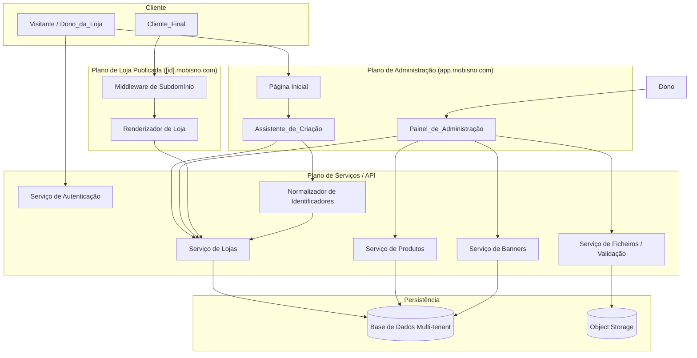
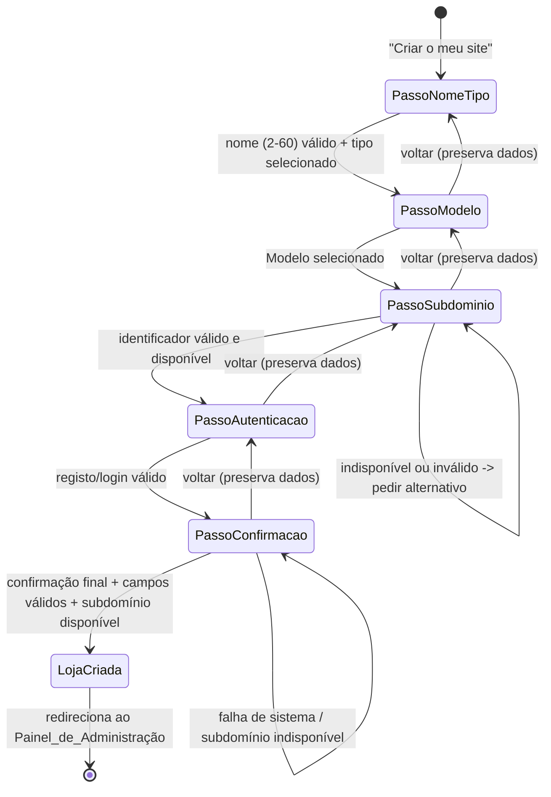
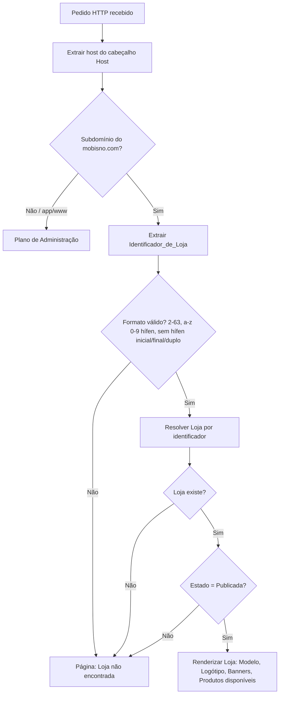
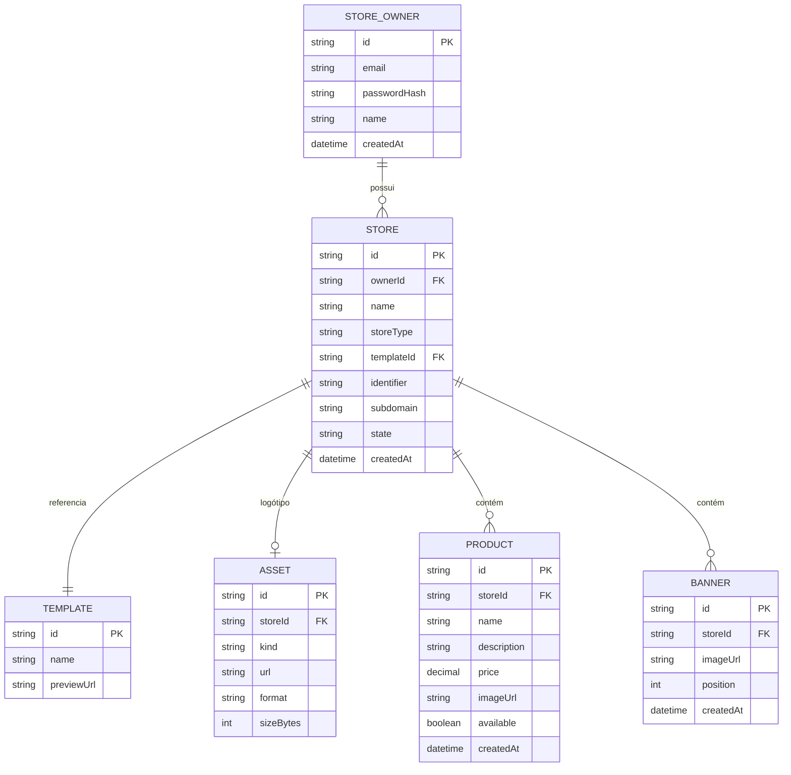

# Design Document

## Overview

O MôBisno é uma plataforma SaaS multi-inquilino (multi-tenant) que permite a qualquer pessoa criar e gerir uma loja online através de um fluxo guiado e simples. Esta fase cobre: o Assistente_de_Criação de lojas, o provisionamento de subdomínios no formato `[identificador].mobisno.com`, a autenticação de donos de loja, a seleção de Modelos pré-construídos, a gestão de identidade visual (Logótipo), o cadastro de Produtos, a gestão de Banners e a renderização da loja publicada por subdomínio.

O design assume uma arquitetura web moderna com três planos lógicos:

- **Plano de Administração** (app principal em `app.mobisno.com` e `www.mobisno.com`): página inicial, Assistente_de_Criação e Painel_de_Administração autenticado.
- **Plano de Loja Publicada** (qualquer `[identificador].mobisno.com`): renderização pública e só-leitura das lojas com estado Publicada.
- **Plano de API/Serviços**: lógica de negócio, isolamento de inquilinos, normalização de identificadores, validação de ficheiros e persistência.

Princípios orientadores do design:

1. **Simplicidade e acessibilidade**: interface totalmente em português, fluxo numerado, mensagens de erro junto ao campo, e preservação de dados em todas as transições. (Requisito 10)
2. **Isolamento de inquilinos**: todos os dados de uma Loja pertencem a um único Dono_da_Loja e nenhuma operação pode aceder ou alterar dados de outra Loja. (Requisitos 5.2, 7.9)
3. **Validação determinística**: a normalização de nomes em Identificador_de_Loja e a validação de ficheiros são funções puras e testáveis. (Requisitos 4, 6, 7, 8)
4. **Segurança por omissão na renderização pública**: o plano público nunca expõe dados de lojas não publicadas nem de subdomínios inexistentes ou inválidos. (Requisito 9)

### Decisões de Arquitetura e Justificações

- **Multi-tenancy por linha partilhada com `store_id`**: cada tabela de domínio carrega um `store_id` e todas as consultas filtram obrigatoriamente por esse campo. Escolhido por simplicidade operacional para a primeira fase, evitando o custo de gerir uma base de dados por inquilino. O isolamento é garantido na camada de serviço (e reforçado por verificação de propriedade do recurso).
- **Roteamento por subdomínio (host-based routing)**: um middleware extrai o Identificador_de_Loja do cabeçalho `Host`, valida o formato e resolve a Loja. Mantém o endereço dedicado por loja sem necessitar de configuração manual de DNS por cliente (wildcard DNS `*.mobisno.com`).
- **Armazenamento de ficheiros em object storage**: Logótipos, imagens de Produto e Banners são guardados num serviço de objetos (ex.: S3-compatível) e referenciados por URL. A validação de formato e tamanho ocorre antes da persistência.
- **Modelos não editáveis**: nesta fase os Modelos são componentes de renderização pré-construídos, identificados por `template_id`. A Loja apenas referencia o Modelo selecionado.

## Architecture

### Diagrama de Componentes de Alto Nível



### Fluxo do Assistente_de_Criação (máquina de estados)



O estado do Assistente é mantido do lado do cliente (estado de sessão do wizard) e validado no servidor em cada transição. A navegação para trás nunca descarta dados já introduzidos (Requisitos 1.6, 10.4). A autenticação é exigida antes da conclusão da criação; se o Visitante iniciar sem conta, o passo de autenticação é apresentado preservando os dados do wizard (Requisitos 1.4, 1.5).

### Roteamento por Subdomínio



Nota: o Requisito 9.5 admite identificadores de comprimento 1–63 na validação de formato do subdomínio acedido, enquanto a geração de novos identificadores (Requisito 4.7) exige 2–63. O middleware aceita o formato 1–63 para fins de resolução; identificadores de comprimento 1 simplesmente nunca corresponderão a uma Loja existente (resultando em "Loja não encontrada"), mantendo a coerência.

## Components and Interfaces

### 1. Serviço de Autenticação (AuthService)

Responsável pelo registo e autenticação do Dono_da_Loja.

```typescript
interface AuthService {
  register(input: { email: string; password: string; name: string }): Promise<Result<Session, AuthError>>;
  login(input: { email: string; password: string }): Promise<Result<Session, AuthError>>;
  getCurrentOwner(session: Session): Promise<StoreOwner | null>;
}
```

- Valida dados de registo/autenticação; em caso de inválidos ou incompletos, devolve erro com motivo e a UI preserva os dados do wizard (Requisitos 1.4, 1.5).

### 2. Normalizador de Identificadores (IdentifierService)

Função pura central para o provisionamento de subdomínios (Requisito 4).

```typescript
interface IdentifierService {
  // Normaliza um nome de Loja num Identificador_de_Loja
  normalize(name: string): string;
  // Valida se um identificador respeita as regras de formato
  isValidFormat(identifier: string): boolean;
  // Verifica disponibilidade (não usado + não reservado)
  isAvailable(identifier: string): Promise<boolean>;
  // Compõe o subdomínio completo
  toSubdomain(identifier: string): string; // `${identifier}.mobisno.com`
}
```

Algoritmo de `normalize` (Requisito 4.1, 4.2):
1. Converter para minúsculas.
2. Substituir espaços e caracteres não alfanuméricos por hífen.
3. Colapsar hífenes consecutivos num único hífen.
4. Remover hífenes no início e no fim.
5. Se o resultado exceder 63 caracteres, truncar para 63 e remover hífen final resultante.

`isValidFormat` (Requisito 4.7): aceita apenas `[a-z0-9-]`, comprimento 2–63, sem hífen inicial/final e sem hífenes consecutivos.

Identificadores reservados (exemplos): `app`, `www`, `admin`, `api`, `mail`, `static`, `assets`. A lista é configurável.

### 3. Serviço de Lojas (StoreService)

```typescript
interface StoreService {
  createStore(owner: StoreOwner, input: CreateStoreInput): Promise<Result<Store, CreateStoreError>>;
  getStoreByIdentifier(identifier: string): Promise<Store | null>;
  getStoresForOwner(ownerId: string): Promise<Store[]>;
  setTemplate(ownerId: string, storeId: string, templateId: string): Promise<Result<Store, StoreError>>;
}

interface CreateStoreInput {
  name: string;
  storeType: StoreType;
  templateId: string;
  identifier: string; // já normalizado/validado
}
```

- Cria a Loja apenas com todos os campos obrigatórios válidos, num prazo máximo de 10 s, associando-a exclusivamente ao Dono_da_Loja autenticado (Requisitos 5.1, 5.2).
- Revalida a disponibilidade do subdomínio na confirmação final; se indisponível, rejeita sem persistir Loja parcial (Requisitos 5.4, 5.5).
- `setTemplate` substitui o Modelo previamente associado, mantendo apenas um (Requisito 3.3).
- Todas as operações de leitura/escrita filtram por `ownerId`/`storeId` para garantir isolamento (Requisitos 5.2, 7.9).

### 4. Serviço de Ficheiros (FileService)

```typescript
interface FileService {
  validate(file: UploadedFile, policy: FilePolicy): Result<ValidFile, FileError>;
  store(storeId: string, kind: AssetKind, file: ValidFile): Promise<StoredAsset>;
}

interface FilePolicy {
  allowedFormats: ImageFormat[]; // ex.: ["png", "jpeg", "svg"]
  minBytes: number;              // ex.: 1024 para logótipo
  maxBytes: number;              // ex.: 5 * 1024 * 1024
}
```

Políticas por tipo de recurso:

| Recurso  | Formatos aceites | Tamanho mín. | Tamanho máx. |
|----------|------------------|--------------|--------------|
| Logótipo | PNG, JPEG, SVG   | 1 KB         | 5 MB         |
| Produto  | PNG, JPEG, SVG   | —            | 5 MB         |
| Banner   | PNG, JPEG        | —            | 5 MB         |

- `validate` rejeita formatos não suportados, ficheiros acima do limite, e ficheiros vazios ou corrompidos, sem persistir, mantendo o recurso anterior inalterado (Requisitos 6.3, 6.4, 7.4, 8.3).
- A deteção de formato baseia-se no conteúdo (assinatura/magic bytes) e não apenas na extensão.

### 5. Serviço de Produtos (ProductService)

```typescript
interface ProductService {
  create(ownerId: string, storeId: string, input: ProductInput): Promise<Result<Product, ProductError>>;
  update(ownerId: string, storeId: string, productId: string, input: ProductInput): Promise<Result<Product, ProductError>>;
  remove(ownerId: string, storeId: string, productId: string): Promise<Result<void, ProductError>>;
  listForStore(storeId: string): Promise<Product[]>;
  listAvailableForPublic(storeId: string): Promise<Product[]>;
}
```

- Valida nome (1–120), descrição (≤2000), preço (0,00–999.999.999,99) e imagem (≤5 MB) (Requisito 7.1).
- Rejeita produtos sem nome/preço ou com preço negativo, preservando os dados (Requisitos 7.2, 7.3).
- `update`/`remove` rejeitam recursos inexistentes ou de outra Loja (Requisito 7.9).
- `listAvailableForPublic` devolve apenas produtos disponíveis (Requisito 7.8).

### 6. Serviço de Banners (BannerService)

```typescript
interface BannerService {
  add(ownerId: string, storeId: string, file: UploadedFile): Promise<Result<Banner, BannerError>>;
  remove(ownerId: string, storeId: string, bannerId: string): Promise<Result<void, BannerError>>;
  listOrdered(storeId: string): Promise<Banner[]>; // por ordem de adição
}
```

- Impõe o máximo de 10 Banners por Loja (Requisitos 8.1, 8.4).
- Mantém e devolve os Banners pela ordem de adição (Requisito 8.5).
- Falha de carregamento não afeta Banners existentes (Requisito 8.6).

### 7. Middleware de Subdomínio + Renderizador de Loja (StorefrontRenderer)

```typescript
interface StorefrontResolver {
  resolve(host: string): Promise<StorefrontResult>;
}

type StorefrontResult =
  | { kind: "render"; store: Store; logo: Asset; banners: Banner[]; products: Product[] }
  | { kind: "not_found" };
```

- Devolve `not_found` para formato inválido, Loja inexistente, ou Loja não Publicada — sem expor quaisquer dados dessa Loja (Requisitos 9.3, 9.4, 9.5).
- Para Loja Publicada, devolve Modelo, Logótipo, Banners e produtos disponíveis (Requisito 9.1).

### Painel de Administração e Página Inicial (UI)

- A página inicial apresenta de forma permanente e acima da dobra a ação única "Criar o meu site" (Requisito 1.1).
- O Assistente apresenta passos numerados, passo atual/total e navegação para trás sem perda de dados (Requisitos 1.6, 10.1, 10.4, 10.5, 10.6).
- Todos os textos da interface são apresentados em português (Requisito 10.3).
- Mensagens de erro são apresentadas junto a cada campo inválido (Requisitos 10.2, 10.6).

## Data Models



### Definições de Tipos

```typescript
type StoreState = "Rascunho" | "Publicada";

type StoreType =
  | "Vestuário" | "Alimentação" | "Eletrónica"
  | "Beleza" | "Serviços" | "Outro";

type ImageFormat = "png" | "jpeg" | "svg";

type AssetKind = "logo" | "product" | "banner";

interface Store {
  id: string;
  ownerId: string;          // proprietário exclusivo (isolamento)
  name: string;             // 2–60 caracteres (após trim)
  storeType: StoreType;
  templateId: string;       // exatamente um Modelo
  identifier: string;       // 2–63, [a-z0-9-], sem hífen inicial/final/duplo
  subdomain: string;        // `${identifier}.mobisno.com`
  state: StoreState;
  createdAt: string;
}

interface Product {
  id: string;
  storeId: string;
  name: string;             // 1–120
  description: string;      // ≤2000
  price: number;            // 0,00–999.999.999,99
  imageUrl?: string;
  available: boolean;
  createdAt: string;
}

interface Banner {
  id: string;
  storeId: string;
  imageUrl: string;
  position: number;         // ordem de adição (crescente)
  createdAt: string;
}
```

### Invariantes de Dados

- **Propriedade exclusiva**: cada `Store.ownerId` referencia exatamente um Dono_da_Loja; `Product`/`Banner`/`Asset` pertencem a exatamente uma `Store`.
- **Unicidade de identificador**: `Store.identifier` é único na Plataforma e não pertence ao conjunto de identificadores reservados.
- **Coerência de subdomínio**: `Store.subdomain === identifier + ".mobisno.com"`.
- **Limite de Banners**: `count(Banner where storeId = X) ≤ 10`.
- **Ordem de Banners**: `position` reflete a ordem de adição de forma estritamente crescente por Loja.

## Correctness Properties

*Uma propriedade é uma característica ou comportamento que deve ser verdadeiro em todas as execuções válidas de um sistema — essencialmente, uma afirmação formal sobre o que o sistema deve fazer. As propriedades servem de ponte entre especificações legíveis por humanos e garantias de correção verificáveis por máquina.*

As propriedades abaixo resultam da análise de prework e foram consolidadas para eliminar redundância. Cada uma é universalmente quantificada e destina-se a testes baseados em propriedades.

### Property 1: Validação de comprimento do nome da Loja

*Para qualquer* string de nome, após remoção de espaços no início e no fim, o nome é aceite se e só se tiver entre 2 e 60 caracteres inclusive; nomes vazios/só de espaços ou com menos de 2 ou mais de 60 caracteres são rejeitados, mantendo o passo atual e preservando o nome introduzido.

**Validates: Requirements 2.2, 2.5, 2.6, 2.7**

### Property 2: Normalização de nome em Identificador_de_Loja

*Para qualquer* nome de Loja, o resultado de `normalize` está sempre em minúsculas, contém apenas `[a-z0-9-]`, não tem hífenes consecutivos nem hífenes no início ou no fim, e tem no máximo 63 caracteres.

**Validates: Requirements 4.1, 4.2**

### Property 3: Normalização produz formato válido ou é rejeitada

*Para qualquer* nome de Loja, se o identificador normalizado tiver pelo menos 2 caracteres então satisfaz `isValidFormat`; caso contrário (menos de 2 caracteres) é rejeitado com pedido de nome alternativo, sem persistir a Loja.

**Validates: Requirements 4.3, 4.7**

### Property 4: Validação de formato de identificador

*Para qualquer* string de identificador, `isValidFormat` devolve verdadeiro se e só se a string tiver entre 2 e 63 caracteres, for composta apenas por letras minúsculas, dígitos e hífenes, e não contiver hífenes no início, no fim ou consecutivos; identificadores alternativos que falhem esta regra são rejeitados.

**Validates: Requirements 4.7, 4.8**

### Property 5: Composição determinística do subdomínio

*Para qualquer* identificador válido, o subdomínio composto é exatamente `identificador + ".mobisno.com"`, e a extração do identificador a partir desse subdomínio devolve o identificador original (round trip).

**Validates: Requirements 4.4**

### Property 6: Unicidade e reserva de identificador

*Para qualquer* conjunto de Lojas existentes e qualquer identificador, a criação só é permitida quando o identificador não corresponde a uma Loja existente nem a um identificador reservado; caso contrário a operação é rejeitada por indisponibilidade e nenhuma Loja é persistida.

**Validates: Requirements 4.5, 5.5**

### Property 7: Posse exclusiva da Loja criada

*Para qualquer* Dono_da_Loja autenticado e input de criação válido, a Loja criada fica associada exclusivamente a esse Dono e a nenhum outro.

**Validates: Requirements 5.2**

### Property 8: Validação de input de criação na confirmação final

*Para qualquer* estado do Assistente_de_Criação, a confirmação final cria a Loja se e só se todos os campos obrigatórios forem válidos; havendo campos em falta ou inválidos, a criação é impedida, os campos em causa são identificados e os dados introduzidos são preservados.

**Validates: Requirements 5.1, 5.6, 10.6**

### Property 9: Atomicidade da criação em falha

*Para qualquer* falha de sistema durante a criação, nenhuma Loja parcial é persistida e os dados introduzidos no Assistente são preservados.

**Validates: Requirements 5.4**

### Property 10: Modelo único associado à Loja

*Para qualquer* sequência de seleções de Modelo numa Loja, após cada confirmação existe exatamente um Modelo associado, igual ao último selecionado.

**Validates: Requirements 3.3**

### Property 11: Validação de ficheiro por política

*Para qualquer* ficheiro carregado e qualquer política de recurso (Logótipo, Produto ou Banner), o ficheiro é aceite se e só se o seu formato pertencer aos formatos permitidos e o seu tamanho estiver dentro dos limites mínimo e máximo da política e não estiver vazio/corrompido; ficheiros rejeitados não são persistidos e o recurso anterior permanece inalterado.

**Validates: Requirements 6.2, 6.3, 6.4, 7.4, 8.2, 8.3**

### Property 12: Identidade visual de substituição na ausência de Logótipo

*Para qualquer* Loja sem Logótipo definido, a renderização do cabeçalho e dos menus usa a identidade visual de substituição predefinida; com Logótipo definido, usa o Logótipo.

**Validates: Requirements 6.7**

### Property 13: Validação de Produto

*Para qualquer* input de Produto, o registo é aceite se e só se tiver nome (1–120 caracteres), preço presente entre 0,00 e 999.999.999,99, e descrição até 2000 caracteres; inputs sem nome/preço ou com preço negativo são rejeitados, preservando os dados e indicando os campos em causa.

**Validates: Requirements 7.1, 7.2, 7.3, 7.5**

### Property 14: Isolamento de inquilino em operações de Produto

*Para qualquer* par de Lojas distintas e qualquer Produto, uma tentativa de editar ou remover um Produto que não pertence à Loja do Dono autenticado (ou inexistente) é sempre rejeitada com erro, sem alterar dados de qualquer Loja.

**Validates: Requirements 7.9**

### Property 15: Filtragem de produtos disponíveis na loja publicada

*Para qualquer* conjunto de Produtos de uma Loja, a listagem pública contém exatamente os Produtos associados a essa Loja e marcados como disponíveis, e nenhum outro.

**Validates: Requirements 7.8**

### Property 16: Limite máximo de Banners

*Para qualquer* sequência de adições de Banner a uma Loja, o número de Banners associados nunca excede 10; adições para além de 10 são impedidas com mensagem, sem alterar os Banners existentes.

**Validates: Requirements 8.1, 8.4**

### Property 17: Ordem de exibição de Banners

*Para qualquer* sequência de adições de Banner, a listagem de Banners da loja publicada respeita a ordem de adição (estritamente crescente por posição).

**Validates: Requirements 8.5**

### Property 18: Preservação de Banners em falha de carregamento

*Para qualquer* falha no carregamento de um novo Banner, o conjunto de Banners existentes permanece inalterado e continua a ser exibido.

**Validates: Requirements 8.6**

### Property 19: Resolução de storefront por subdomínio

*Para qualquer* host de subdomínio, o renderizador apresenta a Loja (Modelo, Logótipo, Banners, produtos disponíveis) se e só se o identificador tiver formato válido, corresponder a uma Loja existente e essa Loja estiver no estado Publicada; em qualquer outro caso (formato inválido, Loja inexistente ou Loja não Publicada) devolve "Loja não encontrada" sem expor quaisquer dados dessa Loja.

**Validates: Requirements 9.1, 9.3, 9.4, 9.5**

### Property 20: Preservação de dados na navegação do Assistente

*Para qualquer* sequência de navegação entre passos do Assistente_de_Criação (incluindo voltar ao passo anterior) e para qualquer rejeição por dados inválidos, os dados anteriormente introduzidos nos restantes campos permanecem preenchidos e editáveis.

**Validates: Requirements 1.5, 1.6, 10.2, 10.4**

## Error Handling

A estratégia de tratamento de erros assenta em três pilares: validação antecipada, mensagens em português junto ao contexto, e preservação de estado.

### Categorias de Erro

| Categoria | Exemplos | Resposta da Plataforma |
|-----------|----------|------------------------|
| Validação de input | nome vazio/curto/longo, tipo não selecionado, preço negativo, campos obrigatórios em falta | Impedir avanço/registo, mensagem junto ao campo, preservar dados (Req. 2.2, 2.4, 5.6, 7.2, 7.3, 10.2, 10.6) |
| Validação de identificador | normalização <2 chars, formato inválido, indisponível/reservado | Pedir nome/identificador alternativo, indicar formato válido, não persistir (Req. 4.3, 4.5, 4.8, 5.5) |
| Validação de ficheiro | formato não suportado, tamanho >5MB ou <mín., ficheiro vazio/corrompido | Rejeitar sem guardar, manter recurso anterior, indicar formatos/tamanho aceites (Req. 6.3, 6.4, 7.4, 8.3) |
| Limites de domínio | exceder 10 Banners | Impedir adição, mensagem de máximo atingido (Req. 8.4) |
| Autenticação | credenciais inválidas/incompletas | Rejeitar, indicar motivo, preservar dados do wizard (Req. 1.5) |
| Falha de sistema | erro ao criar Loja, falha de upload de Banner | Mensagem de erro, sem persistência parcial, preservar/continuar a exibir o existente (Req. 5.4, 8.6) |
| Recurso inexistente / cross-tenant | editar/remover Produto de outra Loja | Rejeitar com erro, sem alterar dados (Req. 7.9) |
| Resolução de storefront | subdomínio inválido/inexistente/não publicado | Página "Loja não encontrada", sem expor dados (Req. 9.3, 9.4, 9.5) |
| Timeout de arranque | assistente não inicia em 3s | Mensagem de falha + opção de tentar novamente, manter na página inicial (Req. 1.3) |

### Padrão de Resultado

Todos os serviços devolvem um tipo `Result<T, E>` em vez de lançar exceções para erros previsíveis, permitindo que a camada de UI mapeie erros para mensagens em português junto aos campos. Erros inesperados (falhas de sistema) são registados e convertidos numa mensagem genérica de erro com preservação de estado.

### Segurança e Isolamento

- Todas as consultas de domínio filtram por `ownerId`/`storeId`; operações sobre recursos verificam a posse antes de qualquer alteração (Req. 5.2, 7.9).
- O plano público é estritamente só-leitura e nunca resolve dados de lojas não publicadas (Req. 9.4).
- A validação de ficheiros baseia-se no conteúdo (magic bytes), não apenas na extensão, para evitar uploads enganosos.

## Testing Strategy

A estratégia combina testes baseados em propriedades (PBT) para a lógica universal e testes por exemplo/integração para comportamentos específicos, de UI e de infraestrutura.

### Abordagem de Testes Baseados em Propriedades

A funcionalidade é adequada a PBT nas áreas de lógica pura e regras universais: normalização e validação de identificadores, composição de subdomínio, validação de ficheiros por política, validação de Produto, isolamento de inquilino, limites e ordenação de Banners, filtragem de produtos e resolução de storefront.

Requisitos de implementação dos testes de propriedades:
- Usar uma biblioteca de PBT adequada à linguagem alvo (por exemplo, **fast-check** para TypeScript/JavaScript). Não implementar PBT de raiz.
- Cada teste de propriedade executa no mínimo **100 iterações**.
- Cada teste referencia a propriedade do design através de uma etiqueta de comentário no formato:
  `**Feature: mobisno-store-builder, Property {número}: {texto da propriedade}**`
- Cada propriedade de correção (Propriedades 1–20) é implementada por um **único** teste de propriedade.

Mapeamento de geradores (exemplos):
- Nomes de Loja: strings com espaços, vazias, só de espaços, comprimentos variados, caracteres não-alfanuméricos e acentuados (para exercitar normalização e limites). Cobre os edge cases de 4.x e 2.x.
- Identificadores: strings com `[a-z0-9-]`, hífenes iniciais/finais/consecutivos, comprimentos 0–80.
- Ficheiros: combinações de formato (PNG/JPEG/SVG e formatos não suportados), tamanhos (0, <1KB, 1KB, 5MB, >5MB) e conteúdo válido/corrompido. Cobre edge case 6.4.
- Produtos: nomes 0–130, descrições 0–2100, preços negativos, 0, limites e acima do máximo.
- Lojas/Inquilinos: conjuntos de Lojas de diferentes donos para validar isolamento.
- Banners: sequências de adições/remoções para validar limite e ordem.

### Testes por Exemplo (unitários)

Focados em comportamentos específicos e de UI que não beneficiam de quantificação universal:
- Presença da ação única "Criar o meu site" acima da dobra (Req. 1.1).
- Apresentação da lista de Tipo_de_Loja e de Modelos com pré-visualização (Req. 2.3, 3.1).
- Exigência de registo/autenticação antes de concluir (Req. 1.4).
- Submeter sem Tipo_de_Loja / sem Modelo / sem Modelos disponíveis (Req. 2.4, 3.4, 3.5).
- Associação e substituição visível de Modelo (Req. 3.2).
- Apresentação do subdomínio resultante antes da confirmação (Req. 4.6).
- Exibição do Logótipo no cabeçalho e nos menus (Req. 6.5, 6.6).
- Edição e remoção de Produto com confirmação (Req. 7.6, 7.7).
- Remoção de Banner deixa de o exibir (Req. 8.7).
- Indicadores de passo (atual/total/concluído) e instruções de orientação (Req. 10.1, 10.5).
- Textos da interface em português (Req. 10.3) — verificação de chaves de i18n.

### Testes de Integração e Smoke

Para comportamentos dependentes de infraestrutura, desempenho ou serviços externos (não adequados a PBT):
- Arranque do Assistente em ≤3s e mensagem de retry em falha (Req. 1.2, 1.3).
- Criação de Loja em ≤10s e exibição do Painel em ≤5s (Req. 5.1, 5.3).
- Carregamento da loja publicada em ≤3s (Req. 9.2).
- Propagação do Logótipo substituído em ≤60s (Req. 6.8).
- Gravação de Banner em ≤10s e produto na lista em ≤3s (Req. 8.2, 7.5).
- Roteamento por subdomínio com DNS wildcard e object storage (1–3 exemplos representativos).

### Cobertura Combinada

Os testes unitários cobrem exemplos concretos e integração de componentes; os testes de propriedades garantem correção geral sobre todo o espaço de input. Em conjunto asseguram cobertura abrangente das regras de validação, isolamento e renderização desta fase.

## Out of Scope (Fases Futuras)

As seguintes capacidades estão fora do âmbito desta entrega e registadas apenas como contexto:
- **Modelos totalmente editáveis** pelo Dono_da_Loja (nesta fase os Modelos são pré-construídos e não editáveis).
- **Integração com métodos de pagamento de Angola**.
